Sentiment Analysis of Financial News
================

``` r
library(dplyr)
```

    ## Warning: package 'dplyr' was built under R version 4.2.3

``` r
library(ggplot2)
```

    ## Warning: package 'ggplot2' was built under R version 4.2.3

``` r
library(tidytext)
```

    ## Warning: package 'tidytext' was built under R version 4.2.3

``` r
library(textdata)
```

    ## Warning: package 'textdata' was built under R version 4.2.3

``` r
library(sentimentr)
```

    ## Warning: package 'sentimentr' was built under R version 4.2.3

``` r
library(DBI)
```

    ## Warning: package 'DBI' was built under R version 4.2.3

``` r
library(caret)
```

    ## Warning: package 'caret' was built under R version 4.2.3

    ## Warning: package 'lattice' was built under R version 4.2.3

``` r
wd_old <- getwd()

# Verwijs naar de map waar je data staat opgeslagen
wd <- 'D:/Projects/FinancialNewsSentiment'
```

## Validatie

``` r
setwd(wd)
# https://www.kaggle.com/datasets/ankurzing/sentiment-analysis-for-financial-news
df_validation <- read.csv('all-data.csv', header = FALSE)
df_validation <- df_validation %>% rename(true_sentiment = 1, text = 2) %>% mutate(id = row_number()) %>% select(id, text, true_sentiment)
```

Sentiment achterhalen voor de validatie dataset:

``` r
# SentimentR
t <- get_sentences(df_validation$text)
t <- sentiment_by(t)
t <- t %>% rename(score_sentimentr = ave_sentiment) %>% select(-element_id, -word_count, -sd)

# Bing, nrc, loughran
bing <- get_sentiments("bing")
nrc <- get_sentiments("nrc")
loughran <- get_sentiments("loughran")

u <- df_validation %>% unnest_tokens(word, text)
u <- u %>% left_join(bing, by = "word") %>% rename(score_bing = sentiment)
u <- u %>% left_join(nrc, by = "word") %>% rename(score_nrc = sentiment)
```

    ## Warning in left_join(., nrc, by = "word"): Detected an unexpected many-to-many relationship between `x` and `y`.
    ## ℹ Row 12 of `x` matches multiple rows in `y`.
    ## ℹ Row 9760 of `y` matches multiple rows in `x`.
    ## ℹ If a many-to-many relationship is expected, set `relationship =
    ##   "many-to-many"` to silence this warning.

``` r
u <- u %>% left_join(loughran, by = "word") %>% rename(score_loughran = sentiment)
```

    ## Warning in left_join(., loughran, by = "word"): Detected an unexpected many-to-many relationship between `x` and `y`.
    ## ℹ Row 12370 of `x` matches multiple rows in `y`.
    ## ℹ Row 2549 of `y` matches multiple rows in `x`.
    ## ℹ If a many-to-many relationship is expected, set `relationship =
    ##   "many-to-many"` to silence this warning.

``` r
u <- u %>% mutate(score_bing = case_when(score_bing == "positive" ~ 1,
                                         score_bing == "negative" ~ -1))
u <- u %>% mutate(score_nrc = case_when(score_nrc == "positive" ~ 1,
                                        score_nrc == "negative" ~ -1))
u <- u %>% mutate(score_loughran = case_when(score_loughran == "positive" ~ 1,
                                             score_loughran == "negative" ~ -1))

u <- u %>% group_by(id) %>%
  summarize(score_bing = sum(score_bing, na.rm = T),
            score_nrc = sum(score_nrc, na.rm = T),
            score_loughran = sum(score_loughran, na.rm = T))

df_validation <- df_validation %>% bind_cols(t)
df_validation <- df_validation %>% left_join(u, by = "id")
rm(bing, loughran, nrc, t, u)
gc()
```

    ##           used  (Mb) gc trigger  (Mb) max used  (Mb)
    ## Ncells 2533240 135.3    4368968 233.4  4368968 233.4
    ## Vcells 4381872  33.5   10146329  77.5  8388601  64.0

Met sentimentR en Bing hebben we ordinale variabelen (hoe positiever de
score, hoe groter de waarde). Voordat we hier een categorie van maken,
proberen we de scores te visualiseren.

``` r
ggplot(df_validation, aes(x = true_sentiment, y = score_sentimentr, col = true_sentiment)) +
  geom_boxplot() +
  labs(x = "Actual sentiment", y = "Predicted sentiment score using sentimentR", color = "Actual sentiment")
```

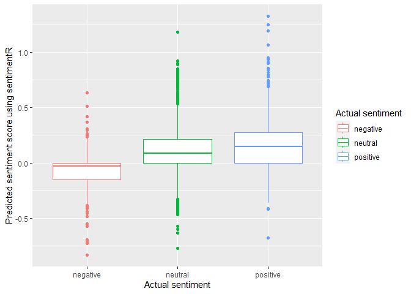<!-- -->

``` r
df_validation %>% filter(true_sentiment != "neutral") %>% 
  ggplot(aes(x = true_sentiment, y = score_bing, col = true_sentiment)) +
  geom_boxplot() +
  labs(x = "Actual sentiment", y = "Predicted sentiment score using Bing", color = "Actual sentiment")
```

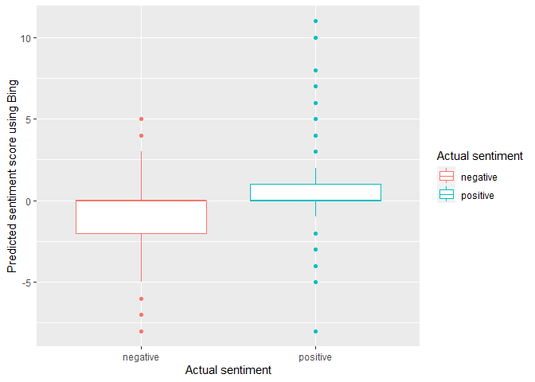<!-- -->

We moeten de ordinale cijfers vertalen naar een classificatie (positief,
neutraal, negatief). Hoe kunnen we dat het beste doen? We berekenen
daarvoor quantiles op basis van de verdeling negative - neutral -
positive die oorspronkelijk in de data zat.

Dit was de oorspronkelijke verdeling voor de validatiedataset:

``` r
df_validation %>% group_by(true_sentiment) %>% summarize(count = n()) %>%
  mutate(percentage = count / sum(count))
```

    ## # A tibble: 3 × 3
    ##   true_sentiment count percentage
    ##   <chr>          <int>      <dbl>
    ## 1 negative         604      0.125
    ## 2 neutral         2879      0.594
    ## 3 positive        1363      0.281

Dit worden de cutoffs als we ze daarop toepassen:

``` r
# Calculate cutoff values using quantiles
cutoff_values_sentimentr <- quantile(df_validation$score_sentimentr, probs = c(0.1247, 0.1247 + 0.5941))
cutoff_values_sentimentr
```

    ##      12.47%      71.88% 
    ## -0.07268094  0.19402850

Oftewel, als de score van sentimentR lager is dan -0.07 classificeren we
de zin als negatief, boven 0.194 is positief, en ertussenin is neutraal.

``` r
# Calculate cutoff values using quantiles
cutoff_values_bing <- quantile(df_validation$score_bing, probs = c(0.1247, 0.1247 + 0.5941))
cutoff_values_nrc <- quantile(df_validation$score_nrc, probs = c(0.1247, 0.1247 + 0.5941))
cutoff_values_loughran <- quantile(df_validation$score_loughran, probs = c(0.1247, 0.1247 + 0.5941))

print('Bing:')
```

    ## [1] "Bing:"

``` r
cutoff_values_bing
```

    ## 12.47% 71.88% 
    ##      0      0

``` r
print('Nrc:')
```

    ## [1] "Nrc:"

``` r
cutoff_values_nrc
```

    ## 12.47% 71.88% 
    ##      0      1

``` r
print('Loughran:')
```

    ## [1] "Loughran:"

``` r
cutoff_values_loughran
```

    ## 12.47% 71.88% 
    ##     -1      0

``` r
# Make predictions using the scores
df_validation$pred_sentimentr <- cut(df_validation$score_sentimentr, breaks = c(-Inf, cutoff_values_sentimentr, Inf), labels = c("negative", "neutral", "positive"), include.lowest = TRUE)
df_validation <- df_validation %>% mutate(pred_bing = ifelse(score_bing < 0, "negative", ifelse(score_bing > 0, "positive", "neutral")))
df_validation$pred_nrc <- cut(df_validation$score_nrc, breaks = c(-Inf, cutoff_values_nrc, Inf), labels = c("negative", "neutral", "positive"), include.lowest = TRUE)
df_validation$pred_loughran <- cut(df_validation$score_loughran, breaks = c(-Inf, cutoff_values_loughran, Inf), labels = c("negative", "neutral", "positive"), include.lowest = TRUE)
```

``` r
# Evaluate the predictions
df_validation$pred_bing <- as.factor(df_validation$pred_bing)
df_validation$true_sentiment <- as.factor(df_validation$true_sentiment)
```

Results SentimentR:

``` r
confusionMatrix(df_validation$pred_sentimentr, df_validation$true_sentiment)
```

    ## Confusion Matrix and Statistics
    ## 
    ##           Reference
    ## Prediction negative neutral positive
    ##   negative      256     261       88
    ##   neutral       323    1811      746
    ##   positive       25     807      529
    ## 
    ## Overall Statistics
    ##                                           
    ##                Accuracy : 0.5357          
    ##                  95% CI : (0.5215, 0.5498)
    ##     No Information Rate : 0.5941          
    ##     P-Value [Acc > NIR] : 1               
    ##                                           
    ##                   Kappa : 0.1594          
    ##                                           
    ##  Mcnemar's Test P-Value : 1.436e-09       
    ## 
    ## Statistics by Class:
    ## 
    ##                      Class: negative Class: neutral Class: positive
    ## Sensitivity                  0.42384         0.6290          0.3881
    ## Specificity                  0.91773         0.4565          0.7611
    ## Pos Pred Value               0.42314         0.6288          0.3887
    ## Neg Pred Value               0.91794         0.4568          0.7607
    ## Prevalence                   0.12464         0.5941          0.2813
    ## Detection Rate               0.05283         0.3737          0.1092
    ## Detection Prevalence         0.12485         0.5943          0.2809
    ## Balanced Accuracy            0.67078         0.5428          0.5746

Results Bing:

``` r
confusionMatrix(df_validation$pred_bing, df_validation$true_sentiment)
```

    ## Confusion Matrix and Statistics
    ## 
    ##           Reference
    ## Prediction negative neutral positive
    ##   negative      245     234      104
    ##   neutral       314    1944      723
    ##   positive       45     701      536
    ## 
    ## Overall Statistics
    ##                                           
    ##                Accuracy : 0.5623          
    ##                  95% CI : (0.5482, 0.5763)
    ##     No Information Rate : 0.5941          
    ##     P-Value [Acc > NIR] : 1               
    ##                                           
    ##                   Kappa : 0.1971          
    ##                                           
    ##  Mcnemar's Test P-Value : 1.012e-07       
    ## 
    ## Statistics by Class:
    ## 
    ##                      Class: negative Class: neutral Class: positive
    ## Sensitivity                  0.40563         0.6752          0.3933
    ## Specificity                  0.92032         0.4728          0.7858
    ## Pos Pred Value               0.42024         0.6521          0.4181
    ## Neg Pred Value               0.91579         0.4987          0.7680
    ## Prevalence                   0.12464         0.5941          0.2813
    ## Detection Rate               0.05056         0.4012          0.1106
    ## Detection Prevalence         0.12031         0.6151          0.2645
    ## Balanced Accuracy            0.66297         0.5740          0.5895

Results NRC:

``` r
confusionMatrix(df_validation$pred_nrc, df_validation$true_sentiment)
```

    ## Confusion Matrix and Statistics
    ## 
    ##           Reference
    ## Prediction negative neutral positive
    ##   negative      448    1269      561
    ##   neutral       117     870      394
    ##   positive       39     740      408
    ## 
    ## Overall Statistics
    ##                                           
    ##                Accuracy : 0.3562          
    ##                  95% CI : (0.3427, 0.3698)
    ##     No Information Rate : 0.5941          
    ##     P-Value [Acc > NIR] : 1               
    ##                                           
    ##                   Kappa : 0.0844          
    ##                                           
    ##  Mcnemar's Test P-Value : <2e-16          
    ## 
    ## Statistics by Class:
    ## 
    ##                      Class: negative Class: neutral Class: positive
    ## Sensitivity                  0.74172         0.3022         0.29934
    ## Specificity                  0.56860         0.7402         0.77634
    ## Pos Pred Value               0.19666         0.6300         0.34372
    ## Neg Pred Value               0.93925         0.4202         0.73900
    ## Prevalence                   0.12464         0.5941         0.28126
    ## Detection Rate               0.09245         0.1795         0.08419
    ## Detection Prevalence         0.47008         0.2850         0.24494
    ## Balanced Accuracy            0.65516         0.5212         0.53784

Results Loughran:

``` r
confusionMatrix(df_validation$pred_loughran, df_validation$true_sentiment)
```

    ## Confusion Matrix and Statistics
    ## 
    ##           Reference
    ## Prediction negative neutral positive
    ##   negative      258     241      126
    ##   neutral       331    2424      891
    ##   positive       15     214      346
    ## 
    ## Overall Statistics
    ##                                          
    ##                Accuracy : 0.6248         
    ##                  95% CI : (0.611, 0.6385)
    ##     No Information Rate : 0.5941         
    ##     P-Value [Acc > NIR] : 6.444e-06      
    ##                                          
    ##                   Kappa : 0.255          
    ##                                          
    ##  Mcnemar's Test P-Value : < 2.2e-16      
    ## 
    ## Statistics by Class:
    ## 
    ##                      Class: negative Class: neutral Class: positive
    ## Sensitivity                  0.42715         0.8420          0.2539
    ## Specificity                  0.91348         0.3787          0.9343
    ## Pos Pred Value               0.41280         0.6648          0.6017
    ## Neg Pred Value               0.91803         0.6208          0.7619
    ## Prevalence                   0.12464         0.5941          0.2813
    ## Detection Rate               0.05324         0.5002          0.0714
    ## Detection Prevalence         0.12897         0.7524          0.1187
    ## Balanced Accuracy            0.67032         0.6104          0.5941

## Data importeren

1.  Kaggle headlines

``` r
setwd(wd)

# Import data
df_kaggle <- read.csv('raw_partner_headlines.csv')
df_kaggle$source <- 'kaggle'

# Set column types
df_kaggle$date <- as.Date(df_kaggle$date, format = "%Y-%m-%d")
df_kaggle$X <- as.character(df_kaggle$X)
df_kaggle <- df_kaggle %>% rename(text = headline)

# Remove duplicate articles that are linked to multiple companies
df_kaggle <- df_kaggle %>% group_by(url) %>% filter(n() == 1) %>% ungroup() %>% select(-stock)
head(df_kaggle)
```

    ## # A tibble: 6 × 6
    ##   X     text                                   url   publisher date       source
    ##   <chr> <chr>                                  <chr> <chr>     <date>     <chr> 
    ## 1 2     Agilent Technologies Announces Pricin… http… GuruFocus 2020-06-01 kaggle
    ## 2 3     Agilent (A) Gears Up for Q2 Earnings:… http… Zacks     2020-05-18 kaggle
    ## 3 6     Agilent Awards Trilogy Sciences with … http… GuruFocus 2020-05-12 kaggle
    ## 4 7     Agilent Technologies Inc (A) CEO and … http… GuruFocus 2020-05-11 kaggle
    ## 5 13    Agilent Technologies Inc (A) CEO and … http… GuruFocus 2020-04-30 kaggle
    ## 6 14    Agilent Technologies Inc (A) CEO and … http… GuruFocus 2020-04-28 kaggle

2.  Reuters

``` r
setwd(paste(wd, '/reuters/', sep = ''))
file_list <- list.files(pattern = "\\.tsv$")

data_list <- list()  # Initialize an empty list to store the data frames

for (file in file_list) {
  filepath <- file  # If the files are in the current working directory
  # Alternatively, if the files are in a subfolder within the working directory:
  # filepath <- file.path("subfolder", file)
  
  # Read the TSV file and store it in the list
  data <- read.delim(filepath)
  data_list[[file]] <- data
}

# Merge all the data frames into a single data frame
df_reuters <- bind_rows(data_list)

rm(data_list, file_list, data, file, filepath)
gc()
```

    ##             used   (Mb) gc trigger   (Mb)  max used   (Mb)
    ## Ncells  22358514 1194.1   34288924 1831.3  24107552 1287.5
    ## Vcells 285663028 2179.5  374703245 2858.8 311589990 2377.3

``` r
df_reuters$date <- as.Date(df_reuters$ts, format = "%Y%m%d")
df_reuters <- df_reuters %>% rename(text = title, url = href) %>% select(-ts) %>% mutate(source = "reuters")
df <- bind_rows(df_kaggle, df_reuters)
df <- df %>% select(-X)
df <- df %>% mutate(id = row_number(),
                    score_sentimentr = NA,
                    score_bing = NA,
                    score_nrc = NA,
                    score_loughran = NA,
                    pred_sentimentr = NA,
                    pred_bing = NA,
                    pred_nrc = NA,
                    pred_loughran = NA)
```

## Schrijf de data weg naar een database

``` r
# setwd(wd)
# con <- dbConnect(RSQLite::SQLite(),dbname="articles.db")
# # dbCreateTable(con, "df", head(df))
# # dbAppendTable(con, "df", head(df))
# dbWriteTable(con, "df", df, overwrite = TRUE)
# dbDisconnect(con)
```

``` r
# show database
# setwd(wd)
# con <- dbConnect(RSQLite::SQLite(),dbname="articles.db")
# db <- tbl(con, "df")
# db %>% count() %>% collect() %>% pull(n)
# db %>% head() %>% collect() 
# dbDisconnect(con)
```

``` r
calculate_scores <- function(df_query) {
  df_query <- df_query %>% select(-score_sentimentr, -score_bing, -score_nrc, -score_loughran, -pred_sentimentr, -pred_bing, -pred_nrc, -pred_loughran)
  # SentimentR
  t <- get_sentences(df_query$text)
  t <- sentiment_by(t)
  t <- t %>% rename(score_sentimentr = ave_sentiment) %>% select(-element_id, -word_count, -sd)
  
  # Bing, nrc, loughran
  bing <- get_sentiments("bing")
  nrc <- get_sentiments("nrc")
  loughran <- get_sentiments("loughran")
  
  u <- df_query %>% unnest_tokens(word, text)
  u <- u %>% left_join(bing, by = "word") %>% rename(score_bing = sentiment)
  u <- u %>% left_join(nrc, by = "word") %>% rename(score_nrc = sentiment)
  u <- u %>% left_join(loughran, by = "word") %>% rename(score_loughran = sentiment)
  
  u <- u %>% mutate(score_bing = case_when(score_bing == "positive" ~ 1,
                                           score_bing == "negative" ~ -1))
  u <- u %>% mutate(score_nrc = case_when(score_nrc == "positive" ~ 1,
                                          score_nrc == "negative" ~ -1))
  u <- u %>% mutate(score_loughran = case_when(score_loughran == "positive" ~ 1,
                                               score_loughran == "negative" ~ -1))
  
  u <- u %>% group_by(id) %>%
    summarize(score_bing = sum(score_bing, na.rm = T),
              score_nrc = sum(score_nrc, na.rm = T),
              score_loughran = sum(score_loughran, na.rm = T))
  
  df_query <- bind_cols(df_query, t)
  df_query <- df_query %>% left_join(u, by = "id")
  
  # Make predictions using the scores
  df_query$pred_sentimentr <- cut(df_query$score_sentimentr, breaks = c(-Inf, cutoff_values_sentimentr, Inf), labels = c("negative", "neutral", "positive"),
                                  include.lowest = TRUE)
  df_query <- df_query %>% mutate(pred_bing = ifelse(score_bing < 0, "negative", ifelse(score_bing > 0, "positive", "neutral")))
  df_query$pred_nrc <- cut(df_query$score_nrc, breaks = c(-Inf, cutoff_values_nrc, Inf), labels = c("negative", "neutral", "positive"), include.lowest = TRUE)
  df_query$pred_loughran <- cut(df_query$score_loughran, breaks = c(-Inf, cutoff_values_loughran, Inf), labels = c("negative", "neutral", "positive"),
                                include.lowest = TRUE)
  df_validation$pred_bing <- as.factor(df_validation$pred_bing)
  df_validation$true_sentiment <- as.factor(df_validation$true_sentiment)
  return(df_query)
}
```

``` r
# setwd(wd)
# con <- dbConnect(RSQLite::SQLite(),dbname="articles.db")
# db <- tbl(con, "df")
#   
# start_row = 1
# bump = 20000
# end_row = start_row + bump
# end_row_limit = row_count <- db %>% count() %>% collect() %>% pull(n)
# dbDisconnect(con)
# 
# while (start_row <= end_row_limit) {
#   setwd(wd)
#   con <- dbConnect(RSQLite::SQLite(),dbname="articles.db")
#   db <- tbl(con, "df")
#   
#   if(end_row_limit - start_row < bump) {
#     end_row = end_row_limit
#   }
#   print(paste('Reading row id', start_row, 'until', end_row))
#   df_query <- db %>% filter(id %in% c(start_row:end_row)) %>% collect()
#   df_query$date <- as.Date(df_query$date, origin = "1970-01-01")
#   dbDisconnect(con)
#   
#   df_query <- calculate_scores(df_query)
#   
#   setwd(wd)
#   con <- dbConnect(RSQLite::SQLite(),dbname="articles.db")
#   db <- tbl(con, "df")
#   print(paste('Writing row id', start_row, 'until', end_row))
#   dbExecute(con, paste("DELETE FROM df WHERE id BETWEEN ", start_row, " AND ", end_row, sep = ""))
#   dbWriteTable(con, "df", df_query, append = TRUE, row.names = FALSE)
#   dbDisconnect(con)
#   
#   start_row <- start_row + bump
#   end_row <- end_row + bump
# }
```

## Sentiment analyseren

1.  Analyse met Kaggle dataset

``` r
setwd(wd)
con <- dbConnect(RSQLite::SQLite(),dbname="articles.db")
db <- tbl(con, "df")
df_kaggle <- db %>% filter(source == "kaggle") %>% collect()
df_kaggle$date <- as.Date(df_kaggle$date, origin = "1970-01-01")
dbDisconnect(con)
```

Meest negatieve headlines SentimentR:

``` r
df_kaggle %>% arrange(score_sentimentr) %>% head(n = 10)
```

    ## # A tibble: 10 × 14
    ##    text     url   publisher date       source     id score_sentimentr score_bing
    ##    <chr>    <chr> <chr>     <date>     <chr>   <int>            <dbl>      <int>
    ##  1 Aeropos… http… Seeking … 2015-08-26 kaggle  35205            -2.14         -4
    ##  2 PepsiCo… http… Seeking … 2016-07-13 kaggle 319823            -1.87         -2
    ##  3 The AES… http… GuruFocus 2012-11-26 kaggle  10827            -1.86         -2
    ##  4 Canada'… http… Seeking … 2018-10-20 kaggle 174809            -1.84          1
    ##  5 Ethan A… http… Seeking … 2017-01-31 kaggle 171529            -1.79         -5
    ##  6 Economy… http… Seeking … 2015-05-18 kaggle 527418            -1.73         -7
    ##  7 Intesa … http… Seeking … 2019-09-27 kaggle 442129            -1.58          5
    ##  8 Ensco -… http… Seeking … 2015-06-19 kaggle 171090            -1.56         -2
    ##  9 Therape… http… Seeking … 2018-11-21 kaggle 516360            -1.5           0
    ## 10 Nova Li… http… Seeking … 2018-04-03 kaggle 366721            -1.50         -1
    ## # ℹ 6 more variables: score_nrc <int>, score_loughran <int>,
    ## #   pred_sentimentr <chr>, pred_bing <chr>, pred_nrc <chr>, pred_loughran <chr>

Meest negatieve headlines NRC:

``` r
df_kaggle %>% arrange(score_nrc) %>% head(n = 10)
```

    ## # A tibble: 10 × 14
    ##    text     url   publisher date       source     id score_sentimentr score_bing
    ##    <chr>    <chr> <chr>     <date>     <chr>   <int>            <dbl>      <int>
    ##  1 "Airlin… http… Investor… 2016-03-24 kaggle  20469           -0.680         -9
    ##  2 "VIX 'F… http… TalkMark… 2020-03-14 kaggle 155950           -0.407        -14
    ##  3 "Why Bi… http… ycharts   2012-08-06 kaggle 289118           -0.617         -5
    ##  4 "Volati… http… Seeking … 2016-06-27 kaggle 558871           -0.866        -30
    ##  5 "The Hi… http… BayStreet 2017-11-06 kaggle  98469           -0.632         -7
    ##  6 "Delek … http… Seeking … 2018-10-08 kaggle 139016           -1.07         -13
    ##  7 "Stocks… http… Investor… 2019-09-09 kaggle 248691           -0.302         -9
    ##  8 "Casino… http… Investor… 2014-08-29 kaggle 336121           -0.833         -8
    ##  9 "ProSha… http… webmaster 2012-06-20 kaggle 411068           -0.265         -5
    ## 10 "Musk's… http… Seeking … 2016-06-23 kaggle 446140           -0.5          -12
    ## # ℹ 6 more variables: score_nrc <int>, score_loughran <int>,
    ## #   pred_sentimentr <chr>, pred_bing <chr>, pred_nrc <chr>, pred_loughran <chr>

Meest negatieve headlines Bing (hierin weegt duidelijk het woord
volatility mee):

``` r
df_kaggle %>% arrange(score_bing) %>% head(n = 10)
```

    ## # A tibble: 10 × 14
    ##    text     url   publisher date       source     id score_sentimentr score_bing
    ##    <chr>    <chr> <chr>     <date>     <chr>   <int>            <dbl>      <int>
    ##  1 Volatil… http… Seeking … 2016-06-27 kaggle 558871          -0.866         -30
    ##  2 Tales F… http… Seeking … 2019-05-14 kaggle 437419          -0.538         -21
    ##  3 Market … http… Seeking … 2019-05-02 kaggle  13448          -0.354         -20
    ##  4 Heighte… http… Seeking … 2016-09-19 kaggle 468435          -0.278         -20
    ##  5 Market … http… Seeking … 2018-10-15 kaggle 482037          -0.316         -20
    ##  6 Market … http… Seeking … 2018-04-05 kaggle 482046          -0.277         -20
    ##  7 Volatil… http… Seeking … 2016-12-01 kaggle 496688           0.0277        -20
    ##  8 Zacks I… http… Zacks     2015-08-26 kaggle 537766          -0.0835        -20
    ##  9 Market … http… Seeking … 2018-01-10 kaggle 557736          -0.0668        -20
    ## 10 Market … http… Seeking … 2019-09-17 kaggle 558091          -0.333         -20
    ## # ℹ 6 more variables: score_nrc <int>, score_loughran <int>,
    ## #   pred_sentimentr <chr>, pred_bing <chr>, pred_nrc <chr>, pred_loughran <chr>

Meest negatieve headlines Loughran:

``` r
df_kaggle %>% arrange(score_loughran) %>% head(n = 10)
```

    ## # A tibble: 10 × 14
    ##    text     url   publisher date       source     id score_sentimentr score_bing
    ##    <chr>    <chr> <chr>     <date>     <chr>   <int>            <dbl>      <int>
    ##  1 Volatil… http… Seeking … 2016-06-27 kaggle 558871          -0.866         -30
    ##  2 Bankrup… http… Seeking … 2018-03-12 kaggle  74595          -0.712          -3
    ##  3 More on… http… Seeking … 2015-04-08 kaggle 515284          -0.647         -13
    ##  4 Coronav… http… Investor… 2020-02-28 kaggle 137144          -0.626          -6
    ##  5 EnteroM… http… Seeking … 2017-01-18 kaggle 172441           0.0378        -12
    ##  6 Italy R… http… Seeking … 2016-12-02 kaggle 175416          -0.748         -12
    ##  7 Vale ta… http… Seeking … 2019-12-12 kaggle 526564          -0.0555        -12
    ##  8 The Dis… http… Seeking … 2016-02-16 kaggle 528259          -0.833         -12
    ##  9 Lagging… http… Seeking … 2015-07-31 kaggle 538074          -0.610          -5
    ## 10 Alemarl… http… Seeking … 2018-11-07 kaggle  18719          -0.237         -16
    ## # ℹ 6 more variables: score_nrc <int>, score_loughran <int>,
    ## #   pred_sentimentr <chr>, pred_bing <chr>, pred_nrc <chr>, pred_loughran <chr>

Dit zijn de headlines met het meest positieve sentiment. Dit is alleen
SentimentR, je kan zelf de code aanpassen als je ook de andere methodes
wilt zien.

``` r
df_kaggle %>% arrange(desc(score_sentimentr)) %>% head(n = 10)
```

    ## # A tibble: 10 × 14
    ##    text     url   publisher date       source     id score_sentimentr score_bing
    ##    <chr>    <chr> <chr>     <date>     <chr>   <int>            <dbl>      <int>
    ##  1 Top 3 B… http… Zacks     2011-10-03 kaggle 253253             2.28          8
    ##  2 KKR: Ou… http… Seeking … 2016-09-21 kaggle 288035             2.01          3
    ##  3 Top 3 R… http… Zacks     2011-09-14 kaggle 253254             1.91          7
    ##  4 Synergy… http… Seeking … 2018-06-13 kaggle 451225             1.79          2
    ##  5 Gulf Co… http… GuruFocus 2014-04-04 kaggle 226490             1.75          1
    ##  6 Pro-Dex… http… Seeking … 2015-07-15 kaggle 391758             1.75          0
    ##  7 AcelRx … http… Seeking … 2019-11-26 kaggle   5810             1.56          3
    ##  8 United … http… Investor… 2013-12-23 kaggle 525214             1.55          1
    ##  9 7% Bond… http… Seeking … 2018-06-12 kaggle  15620             1.54          1
    ## 10 America… http… Zacks     2017-09-06 kaggle  43766             1.52          1
    ## # ℹ 6 more variables: score_nrc <int>, score_loughran <int>,
    ## #   pred_sentimentr <chr>, pred_bing <chr>, pred_nrc <chr>, pred_loughran <chr>

``` r
df_kaggle %>% group_by(date) %>% 
  summarize(n_articles = n(), avg_sentiment = mean(score_sentimentr)) %>%
  filter(date != as.Date("1969-12-31"), n_articles >= 15) %>%
  ggplot(aes(x = date, y = avg_sentiment)) + geom_point() + geom_smooth(level = 0.95) + 
  scale_x_date(breaks = "1 year", date_labels = "%Y") + 
  labs(x = "Date", y = "Average sentiment") +
  ggtitle('Sentiment over time for Kaggle headlines dataset, measured using SentimentR')
```

    ## `geom_smooth()` using method = 'gam' and formula = 'y ~ s(x, bs = "cs")'

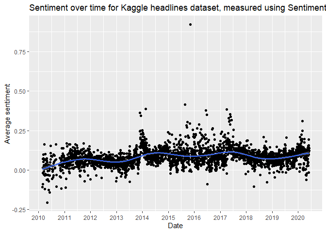<!-- -->

Je kan de grafiek hierboven wat finetunen door alleen de dagen te pakken
waarop veel nieuws was (meer dan vijftig artikelen). Zie de grafiek
hieronder:

``` r
df_kaggle %>% group_by(date) %>% 
  summarize(n_articles = n(), avg_sentiment = mean(score_sentimentr)) %>%
  filter(date != as.Date("1969-12-31"), n_articles >= 50) %>%
  ggplot(aes(x = date, y = avg_sentiment)) + geom_point() + geom_smooth(level = 0.95) + 
  scale_x_date(breaks = "1 year", date_labels = "%Y") + 
  labs(x = "Date", y = "Average sentiment") +
  ggtitle('Sentiment over time for Kaggle headlines dataset, measured using SentimentR')
```

    ## `geom_smooth()` using method = 'gam' and formula = 'y ~ s(x, bs = "cs")'

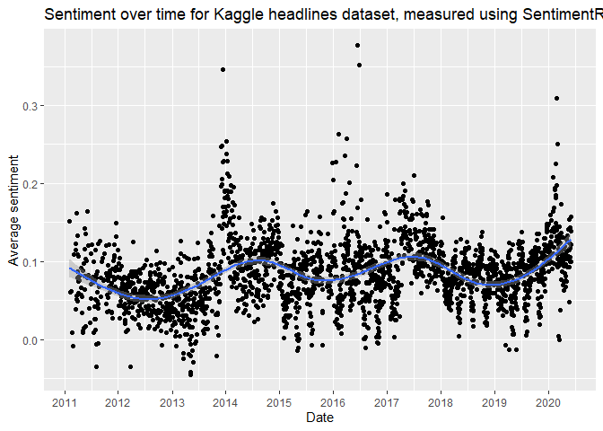<!-- -->

Dan NRC. Dit is een slechte metric volgens de validatieresultaten, dat
zie je hier ook terug.

``` r
df_kaggle %>% group_by(date) %>% 
  summarize(n_articles = n(), avg_sentiment = mean(score_nrc)) %>%
  filter(date != as.Date("1969-12-31"), n_articles >= 15) %>%
  ggplot(aes(x = date, y = avg_sentiment)) + geom_point() + geom_smooth(level = 0.95) + 
  scale_x_date(breaks = "1 year", date_labels = "%Y") + 
  labs(x = "Date", y = "Average sentiment") +
  ggtitle('Sentiment over time for Kaggle headlines dataset, measured using NRC')
```

    ## `geom_smooth()` using method = 'gam' and formula = 'y ~ s(x, bs = "cs")'

    ## Warning: Removed 2 rows containing non-finite values (`stat_smooth()`).

    ## Warning: Removed 2 rows containing missing values (`geom_point()`).

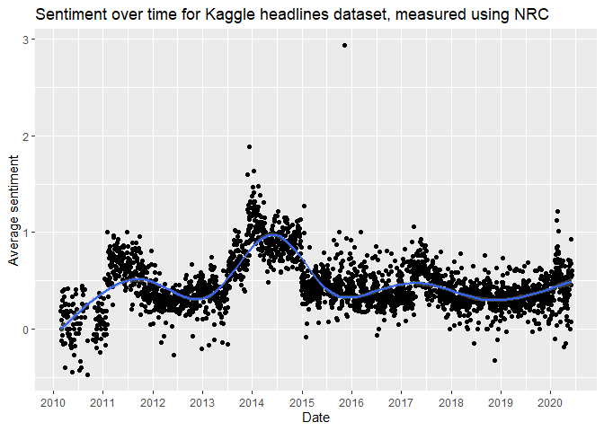<!-- -->

Dan Bing. Hier zit te weinig variatie in, ik zou minstens de outlier
wegsnijden.

``` r
df_kaggle %>% group_by(date) %>% 
  summarize(n_articles = n(), avg_sentiment = mean(score_bing)) %>%
  filter(date != as.Date("1969-12-31"), n_articles >= 15) %>%
  ggplot(aes(x = date, y = avg_sentiment)) + geom_point() + geom_smooth(level = 0.95) + 
  scale_x_date(breaks = "1 year", date_labels = "%Y") + 
  labs(x = "Date", y = "Average sentiment") +
  ggtitle('Sentiment over time for Kaggle headlines dataset, measured using Bing')
```

    ## `geom_smooth()` using method = 'gam' and formula = 'y ~ s(x, bs = "cs")'

    ## Warning: Removed 2 rows containing non-finite values (`stat_smooth()`).

    ## Warning: Removed 2 rows containing missing values (`geom_point()`).

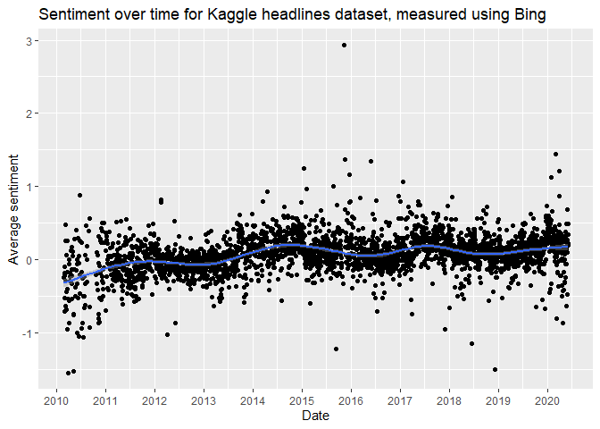<!-- -->

Dan Loughran. Ook niet zo spannend.

``` r
df_kaggle %>% group_by(date) %>% 
  summarize(n_articles = n(), avg_sentiment = mean(score_loughran)) %>%
  filter(date != as.Date("1969-12-31"), n_articles >= 15) %>%
  ggplot(aes(x = date, y = avg_sentiment)) + geom_point() + geom_smooth(level = 0.95) + 
  scale_x_date(breaks = "1 year", date_labels = "%Y") + 
  labs(x = "Date", y = "Average sentiment") +
  ggtitle('Sentiment over time for Kaggle headlines dataset, measured using Loughran')
```

    ## `geom_smooth()` using method = 'gam' and formula = 'y ~ s(x, bs = "cs")'

    ## Warning: Removed 2 rows containing non-finite values (`stat_smooth()`).

    ## Warning: Removed 2 rows containing missing values (`geom_point()`).

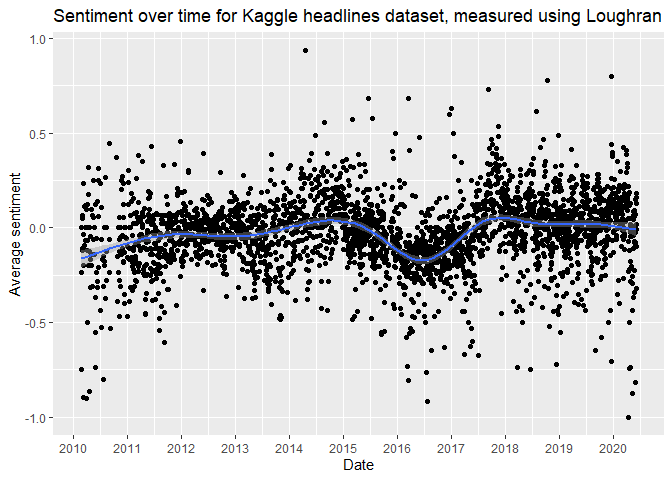<!-- -->

We hebben sentiment gemeten op meerdere manieren. Eerst hebben we per
methode de score berekend, maar daarna hebben we het artikel ook
geclassificeerd op positief / negatief / neutraal. Laten we eens die
classificatie gebruiken om te zien of dat andere grafieken oplevert.

``` r
df_kaggle %>% group_by(date, pred_sentimentr) %>%
  summarize(n_articles = n()) %>%
  filter(date != as.Date("1969-12-31"), n_articles >= 15) %>%
  ggplot(aes(x = date, y = n_articles, group = pred_sentimentr, col = pred_sentimentr)) + geom_smooth(level = 0.95) + 
  scale_x_date(breaks = "1 year", date_labels = "%Y") + 
  labs(x = "Date", y = "Number of articles", color = "Sentiment") + 
  ggtitle('Sentiment over time for Kaggle headlines dataset, measured using SentimentR')
```

    ## `summarise()` has grouped output by 'date'. You can override using the
    ## `.groups` argument.
    ## `geom_smooth()` using method = 'gam' and formula = 'y ~ s(x, bs = "cs")'

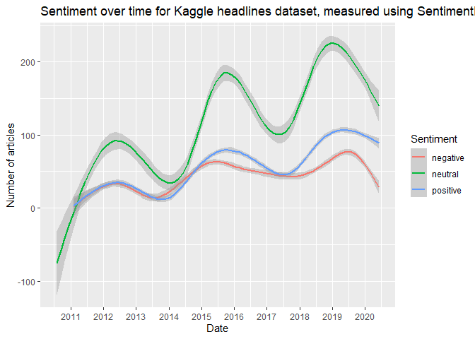<!-- -->

Zelfde voor Bing:

``` r
df_kaggle %>% group_by(date, pred_bing) %>%
  summarize(n_articles = n()) %>%
  filter(date != as.Date("1969-12-31"), n_articles >= 15) %>%
  ggplot(aes(x = date, y = n_articles, group = pred_bing, col = pred_bing)) + geom_smooth(level = 0.95) + 
  scale_x_date(breaks = "1 year", date_labels = "%Y") + 
  labs(x = "Date", y = "Number of articles", color = "Sentiment") + 
  ggtitle('Sentiment over time for Kaggle headlines dataset, measured using Bing')
```

    ## `summarise()` has grouped output by 'date'. You can override using the
    ## `.groups` argument.
    ## `geom_smooth()` using method = 'gam' and formula = 'y ~ s(x, bs = "cs")'

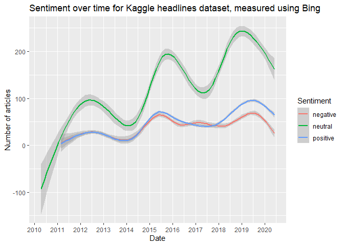<!-- -->

Zelfde voor NRC:

``` r
df_kaggle %>% group_by(date, pred_nrc) %>%
  summarize(n_articles = n()) %>%
  filter(date != as.Date("1969-12-31"), n_articles >= 15) %>%
  ggplot(aes(x = date, y = n_articles, group = pred_nrc, col = pred_nrc)) + geom_smooth(level = 0.95) + 
  scale_x_date(breaks = "1 year", date_labels = "%Y") + 
  labs(x = "Date", y = "Number of articles", color = "Sentiment") + 
  ggtitle('Sentiment over time for Kaggle headlines dataset, measured using NRC')
```

    ## `summarise()` has grouped output by 'date'. You can override using the
    ## `.groups` argument.
    ## `geom_smooth()` using method = 'gam' and formula = 'y ~ s(x, bs = "cs")'

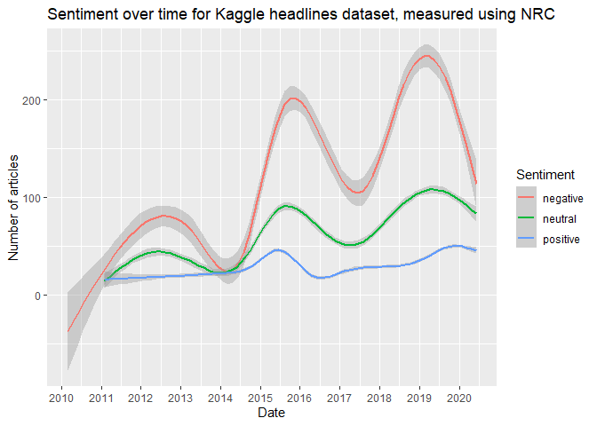<!-- -->

Zelfde voor Loughran:

``` r
df_kaggle %>% group_by(date, pred_loughran) %>%
  summarize(n_articles = n()) %>%
  filter(date != as.Date("1969-12-31"), n_articles >= 15) %>%
  ggplot(aes(x = date, y = n_articles, group = pred_loughran, col = pred_loughran)) + geom_smooth(level = 0.95) + 
  scale_x_date(breaks = "1 year", date_labels = "%Y") + 
  labs(x = "Date", y = "Number of articles", color = "Sentiment") + 
  ggtitle('Sentiment over time for Kaggle headlines dataset, measured using Loughran')
```

    ## `summarise()` has grouped output by 'date'. You can override using the
    ## `.groups` argument.
    ## `geom_smooth()` using method = 'gam' and formula = 'y ~ s(x, bs = "cs")'

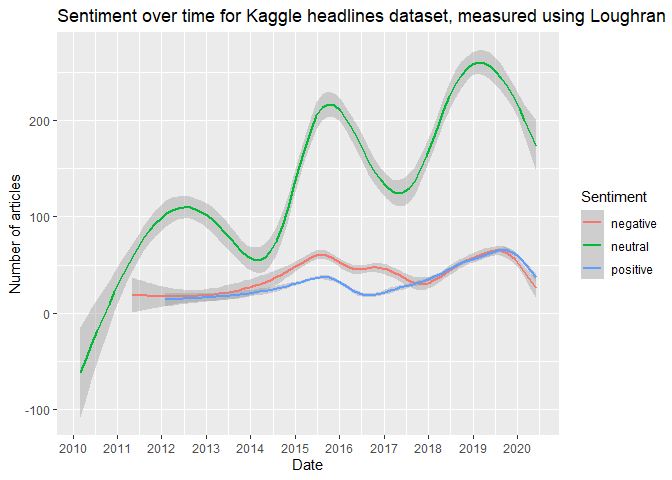<!-- -->

2.  Analyse met Reuters dataset

Nu gaan we hetzelfde herhalen met de tweede dataset met Reuters
headlines.

``` r
rm(df_kaggle)

setwd(wd)
con <- dbConnect(RSQLite::SQLite(),dbname="articles.db")
db <- tbl(con, "df")
df_reuters <- db %>% filter(source == "reuters") %>% collect()
df_reuters$date <- as.Date(df_reuters$date, origin = "1970-01-01")
dbDisconnect(con)
```

Meest negatieve headlines SentimentR:

``` r
df_reuters %>% arrange(score_sentimentr) %>% head(n = 10)
```

    ## # A tibble: 10 × 14
    ##    text     url   publisher date       source     id score_sentimentr score_bing
    ##    <chr>    <chr> <chr>     <date>     <chr>   <int>            <dbl>      <int>
    ##  1 Univers… http… <NA>      2011-12-19 reute… 5.09e6            -2.39         -1
    ##  2 In Chin… http… <NA>      2014-10-29 reute… 7.82e6            -2.34          0
    ##  3 In Chin… http… <NA>      2014-10-29 reute… 7.82e6            -2.34          0
    ##  4 In Chin… http… <NA>      2014-10-29 reute… 7.82e6            -2.34          0
    ##  5 Labour … http… <NA>      2010-09-02 reute… 3.51e6            -2.22         -7
    ##  6 How muc… http… <NA>      2009-10-22 reute… 2.73e6            -2.21         -2
    ##  7 JGBs re… http… <NA>      2008-08-15 reute… 1.67e6            -2.17         -9
    ##  8 Cavs sl… http… <NA>      2010-04-28 reute… 3.18e6            -2.07        -10
    ##  9 Depress… http… <NA>      2007-09-06 reute… 8.09e5            -2.04         -5
    ## 10 Depress… http… <NA>      2007-09-07 reute… 8.11e5            -2.04         -5
    ## # ℹ 6 more variables: score_nrc <int>, score_loughran <int>,
    ## #   pred_sentimentr <chr>, pred_bing <chr>, pred_nrc <chr>, pred_loughran <chr>

Je ziet dat hier herpublicaties in zitten. Zijn wat lastiger te
verwijderen, omdat het niet per ID gaat.

We behouden daarom alleen de articles met unieke tekst (je kan erover
discussiëren of dat juist is voor duplicates, maar dat laat ik aan jou
over). We gaan hiermee van 8,5 miljoen titels naar 6,6 miljoen.

``` r
df_reuters <- df_reuters %>% distinct(text, .keep_all = T)
```

Meest negatieve headlines SentimentR (nu zonder duplicates):

``` r
df_reuters %>% arrange(score_sentimentr) %>% head(n = 10)
```

    ## # A tibble: 10 × 14
    ##    text     url   publisher date       source     id score_sentimentr score_bing
    ##    <chr>    <chr> <chr>     <date>     <chr>   <int>            <dbl>      <int>
    ##  1 Univers… http… <NA>      2011-12-19 reute… 5.09e6            -2.39         -1
    ##  2 In Chin… http… <NA>      2014-10-29 reute… 7.82e6            -2.34          0
    ##  3 Labour … http… <NA>      2010-09-02 reute… 3.51e6            -2.22         -7
    ##  4 How muc… http… <NA>      2009-10-22 reute… 2.73e6            -2.21         -2
    ##  5 JGBs re… http… <NA>      2008-08-15 reute… 1.67e6            -2.17         -9
    ##  6 Cavs sl… http… <NA>      2010-04-28 reute… 3.18e6            -2.07        -10
    ##  7 Depress… http… <NA>      2007-09-06 reute… 8.09e5            -2.04         -5
    ##  8 Tunisia… http… <NA>      2013-08-15 reute… 6.78e6            -2.04         -3
    ##  9 German … http… <NA>      2007-11-12 reute… 8.80e5            -2.02         -6
    ## 10 Deep re… http… <NA>      2008-10-22 reute… 1.84e6            -2.02         -6
    ## # ℹ 6 more variables: score_nrc <int>, score_loughran <int>,
    ## #   pred_sentimentr <chr>, pred_bing <chr>, pred_nrc <chr>, pred_loughran <chr>

Meest negatieve headlines NRC:

Opmerking: met dictionary-based approaches is de kans op een hit groter
in langere titels. Moet je daarvoor corrigeren? Daarvoor kan je beide
kanten beargumenteren.

``` r
df_reuters %>% arrange(score_nrc) %>% head(n = 10)
```

    ## # A tibble: 10 × 14
    ##    text     url   publisher date       source     id score_sentimentr score_bing
    ##    <chr>    <chr> <chr>     <date>     <chr>   <int>            <dbl>      <int>
    ##  1 "Small … http… <NA>      2014-07-16 reute… 7.57e6           -0.136        -30
    ##  2 "RB Iss… http… <NA>      2015-04-22 reute… 8.25e6           -0.362         -5
    ##  3 "MBIA F… http… <NA>      2009-04-30 reute… 2.29e6           -0.461         -6
    ##  4 "Arizon… http… <NA>      2011-01-19 reute… 3.95e6           -0.794        -12
    ##  5 "Defend… http… <NA>      2011-04-05 reute… 4.22e6           -0.722        -15
    ##  6 "BRIEF-… http… <NA>      2012-09-24 reute… 6.01e6           -0.417         -6
    ##  7 "Violen… http… <NA>      2012-10-17 reute… 6.08e6           -0.707        -17
    ##  8 "Zacks … http… <NA>      2013-03-01 reute… 6.42e6           -0.306        -30
    ##  9 "Nation… http… <NA>      2013-04-15 reute… 6.53e6           -0.715         -7
    ## 10 "Roxbor… http… <NA>      2013-10-09 reute… 6.90e6           -0.265        -10
    ## # ℹ 6 more variables: score_nrc <int>, score_loughran <int>,
    ## #   pred_sentimentr <chr>, pred_bing <chr>, pred_nrc <chr>, pred_loughran <chr>

Meest negatieve headlines Bing:

``` r
df_reuters %>% arrange(score_bing) %>% head(n = 10)
```

    ## # A tibble: 10 × 14
    ##    text     url   publisher date       source     id score_sentimentr score_bing
    ##    <chr>    <chr> <chr>     <date>     <chr>   <int>            <dbl>      <int>
    ##  1 "Zacks … http… <NA>      2012-08-06 reute… 5.85e6          -0.3           -30
    ##  2 "Zacks … http… <NA>      2013-03-01 reute… 6.42e6          -0.306         -30
    ##  3 "Small … http… <NA>      2014-02-14 reute… 7.19e6          -0.0759        -30
    ##  4 "Small … http… <NA>      2014-07-16 reute… 7.57e6          -0.136         -30
    ##  5 "On Fif… http… <NA>      2015-07-08 reute… 8.45e6          -0.816         -30
    ##  6 "MultiV… http… <NA>      2010-08-09 reute… 3.44e6          -0.0283        -26
    ##  7 "Pancre… http… <NA>      2011-06-17 reute… 4.47e6          -0.812         -25
    ##  8 "23 Pat… http… <NA>      2011-07-13 reute… 4.55e6          -0.417         -24
    ##  9 "Unexpe… http… <NA>      2013-06-06 reute… 6.64e6           0.117         -24
    ## 10 "Massac… http… <NA>      2007-05-11 reute… 6.95e5           0.619         -23
    ## # ℹ 6 more variables: score_nrc <int>, score_loughran <int>,
    ## #   pred_sentimentr <chr>, pred_bing <chr>, pred_nrc <chr>, pred_loughran <chr>

Meest negatieve headlines Loughran:

``` r
df_reuters %>% arrange(score_loughran) %>% head(n = 10)
```

    ## # A tibble: 10 × 14
    ##    text     url   publisher date       source     id score_sentimentr score_bing
    ##    <chr>    <chr> <chr>     <date>     <chr>   <int>            <dbl>      <int>
    ##  1 " Fairw… http… <NA>      2010-10-20 reute… 3.67e6          -0.775           0
    ##  2 " Divor… http… <NA>      2010-11-03 reute… 3.72e6          -0.703          -6
    ##  3 "Diet D… http… <NA>      2014-08-20 reute… 7.65e6          -0.189         -17
    ##  4 "Amazon… http… <NA>      2009-12-03 reute… 2.84e6          -0.501         -16
    ##  5 "Nation… http… <NA>      2012-12-20 reute… 6.24e6          -0.309           0
    ##  6 "Sanfor… http… <NA>      2015-10-23 reute… 8.71e6          -0.501          -4
    ##  7 "Judge … http… <NA>      2009-11-19 reute… 2.81e6          -0.746         -15
    ##  8 "2010 a… http… <NA>      2009-12-15 reute… 2.87e6          -0.0452        -18
    ##  9 "Arizon… http… <NA>      2011-01-19 reute… 3.95e6          -0.794         -12
    ## 10 "Prepar… http… <NA>      2011-10-17 reute… 4.87e6          -0.273         -23
    ## # ℹ 6 more variables: score_nrc <int>, score_loughran <int>,
    ## #   pred_sentimentr <chr>, pred_bing <chr>, pred_nrc <chr>, pred_loughran <chr>

Dit zijn de headlines met het meest positieve sentiment. Dit is alleen
SentimentR, je kan zelf de code aanpassen als je ook de andere methodes
wilt zien.

``` r
df_reuters %>% arrange(desc(score_sentimentr)) %>% head(n = 10)
```

    ## # A tibble: 10 × 14
    ##    text     url   publisher date       source     id score_sentimentr score_bing
    ##    <chr>    <chr> <chr>     <date>     <chr>   <int>            <dbl>      <int>
    ##  1 "United… http… <NA>      2014-01-07 reute… 7.10e6             2.54          3
    ##  2 " Statu… http… <NA>      2012-03-15 reute… 5.36e6             2.41          6
    ##  3 "Helpin… http… <NA>      2009-10-26 reute… 2.73e6             2.27          7
    ##  4 "More P… http… <NA>      2015-09-17 reute… 8.62e6             2.21          7
    ##  5 "Home H… http… <NA>      2014-05-21 reute… 7.44e6             2.19          8
    ##  6 "Campai… http… <NA>      2011-10-19 reute… 4.88e6             2.17          1
    ##  7 "Study:… http… <NA>      2012-12-05 reute… 6.21e6             2.16          3
    ##  8 "VHA Ho… http… <NA>      2014-05-19 reute… 7.43e6             2.13          4
    ##  9 "Kofax … http… <NA>      2014-05-20 reute… 7.44e6             2.09          7
    ## 10 "QVC In… http… <NA>      2015-11-06 reute… 8.75e6             2.04          5
    ## # ℹ 6 more variables: score_nrc <int>, score_loughran <int>,
    ## #   pred_sentimentr <chr>, pred_bing <chr>, pred_nrc <chr>, pred_loughran <chr>

``` r
df_reuters %>% group_by(date) %>% 
  summarize(n_articles = n(), avg_sentiment = mean(score_sentimentr)) %>%
  filter(date != as.Date("1969-12-31"), n_articles >= 15) %>%
  ggplot(aes(x = date, y = avg_sentiment)) + geom_point() + geom_smooth(level = 0.95) + 
  scale_x_date(breaks = "1 year", date_labels = "%Y") + 
  labs(x = "Date", y = "Average sentiment") +
  ggtitle('Sentiment over time for Reuters headlines dataset, measured using SentimentR')
```

    ## `geom_smooth()` using method = 'gam' and formula = 'y ~ s(x, bs = "cs")'

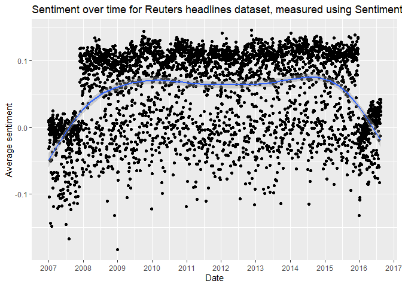<!-- -->

Dan NRC. Dit is een slechte metric volgens de validatieresultaten, dat
zie je hier ook terug.

``` r
df_reuters %>% group_by(date) %>% 
  summarize(n_articles = n(), avg_sentiment = mean(score_nrc)) %>%
  filter(date != as.Date("1969-12-31"), n_articles >= 15) %>%
  ggplot(aes(x = date, y = avg_sentiment)) + geom_point() + geom_smooth(level = 0.95) + 
  scale_x_date(breaks = "1 year", date_labels = "%Y") + 
  labs(x = "Date", y = "Average sentiment") +
  ggtitle('Sentiment over time for Reuters headlines dataset, measured using NRC')
```

    ## `geom_smooth()` using method = 'gam' and formula = 'y ~ s(x, bs = "cs")'

    ## Warning: Removed 8 rows containing non-finite values (`stat_smooth()`).

    ## Warning: Removed 8 rows containing missing values (`geom_point()`).

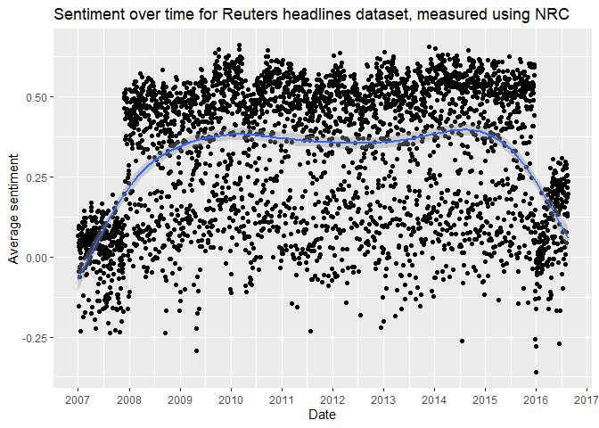<!-- -->

Dan Bing.

``` r
df_reuters %>% group_by(date) %>% 
  summarize(n_articles = n(), avg_sentiment = mean(score_bing)) %>%
  filter(date != as.Date("1969-12-31"), n_articles >= 15) %>%
  ggplot(aes(x = date, y = avg_sentiment)) + geom_point() + geom_smooth(level = 0.95) + 
  scale_x_date(breaks = "1 year", date_labels = "%Y") + 
  labs(x = "Date", y = "Average sentiment") +
  ggtitle('Sentiment over time for Reuters headlines dataset, measured using Bing')
```

    ## `geom_smooth()` using method = 'gam' and formula = 'y ~ s(x, bs = "cs")'

    ## Warning: Removed 8 rows containing non-finite values (`stat_smooth()`).

    ## Warning: Removed 8 rows containing missing values (`geom_point()`).

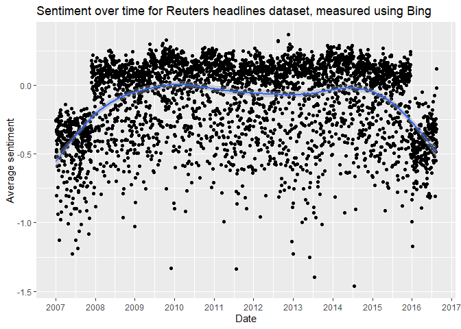<!-- -->

Dan Loughran.

``` r
df_reuters %>% group_by(date) %>% 
  summarize(n_articles = n(), avg_sentiment = mean(score_loughran)) %>%
  filter(date != as.Date("1969-12-31"), n_articles >= 15) %>%
  ggplot(aes(x = date, y = avg_sentiment)) + geom_point() + geom_smooth(level = 0.95) + 
  scale_x_date(breaks = "1 year", date_labels = "%Y") + 
  labs(x = "Date", y = "Average sentiment") +
  ggtitle('Sentiment over time for Reuters headlines dataset, measured using Loughran')
```

    ## `geom_smooth()` using method = 'gam' and formula = 'y ~ s(x, bs = "cs")'

    ## Warning: Removed 8 rows containing non-finite values (`stat_smooth()`).

    ## Warning: Removed 8 rows containing missing values (`geom_point()`).

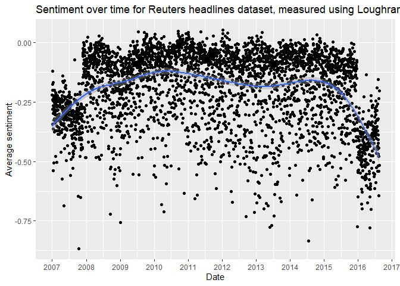<!-- -->

We hebben sentiment gemeten op meerdere manieren. Eerst hebben we per
methode de score berekend, maar daarna hebben we het artikel ook
geclassificeerd op positief / negatief / neutraal. Laten we eens die
classificatie gebruiken om te zien of dat andere grafieken oplevert.

``` r
df_reuters %>% group_by(date, pred_sentimentr) %>%
  summarize(n_articles = n()) %>%
  filter(date != as.Date("1969-12-31"), n_articles >= 15) %>%
  ggplot(aes(x = date, y = n_articles, group = pred_sentimentr, col = pred_sentimentr)) + geom_smooth(level = 0.95) + 
  scale_x_date(breaks = "1 year", date_labels = "%Y") + 
  labs(x = "Date", y = "Number of articles", color = "Sentiment") + 
  ggtitle('Sentiment over time for Kaggle headlines dataset, measured using SentimentR')
```

    ## `summarise()` has grouped output by 'date'. You can override using the
    ## `.groups` argument.
    ## `geom_smooth()` using method = 'gam' and formula = 'y ~ s(x, bs = "cs")'

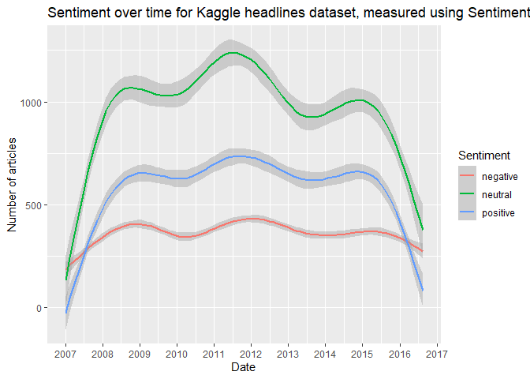<!-- -->

Zelfde voor Bing:

``` r
df_reuters %>% group_by(date, pred_bing) %>%
  summarize(n_articles = n()) %>%
  filter(date != as.Date("1969-12-31"), n_articles >= 15) %>%
  ggplot(aes(x = date, y = n_articles, group = pred_bing, col = pred_bing)) + geom_smooth(level = 0.95) + 
  scale_x_date(breaks = "1 year", date_labels = "%Y") + 
  labs(x = "Date", y = "Number of articles", color = "Sentiment") + 
  ggtitle('Sentiment over time for Kaggle headlines dataset, measured using Bing')
```

    ## `summarise()` has grouped output by 'date'. You can override using the
    ## `.groups` argument.
    ## `geom_smooth()` using method = 'gam' and formula = 'y ~ s(x, bs = "cs")'

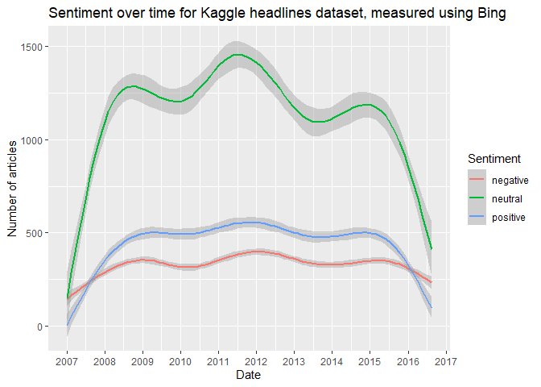<!-- -->

Zelfde voor NRC:

Negative heeft hier bijna dezelfde trend dan neutral bij Bing -\> ik gok
dat er een of een paar woorden zijn die bij NRC op de andere lijst
staan?

``` r
df_reuters %>% group_by(date, pred_nrc) %>%
  summarize(n_articles = n()) %>%
  filter(date != as.Date("1969-12-31"), n_articles >= 15) %>%
  ggplot(aes(x = date, y = n_articles, group = pred_nrc, col = pred_nrc)) + geom_smooth(level = 0.95) + 
  scale_x_date(breaks = "1 year", date_labels = "%Y") + 
  labs(x = "Date", y = "Number of articles", color = "Sentiment") + 
  ggtitle('Sentiment over time for Kaggle headlines dataset, measured using NRC')
```

    ## `summarise()` has grouped output by 'date'. You can override using the
    ## `.groups` argument.
    ## `geom_smooth()` using method = 'gam' and formula = 'y ~ s(x, bs = "cs")'

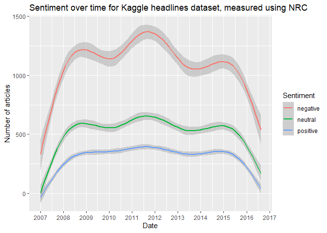<!-- -->

Zelfde voor Loughran:

``` r
df_reuters %>% group_by(date, pred_loughran) %>%
  summarize(n_articles = n()) %>%
  filter(date != as.Date("1969-12-31"), n_articles >= 15) %>%
  ggplot(aes(x = date, y = n_articles, group = pred_loughran, col = pred_loughran)) + geom_smooth(level = 0.95) + 
  scale_x_date(breaks = "1 year", date_labels = "%Y") + 
  labs(x = "Date", y = "Number of articles", color = "Sentiment") + 
  ggtitle('Sentiment over time for Kaggle headlines dataset, measured using Loughran')
```

    ## `summarise()` has grouped output by 'date'. You can override using the
    ## `.groups` argument.
    ## `geom_smooth()` using method = 'gam' and formula = 'y ~ s(x, bs = "cs")'

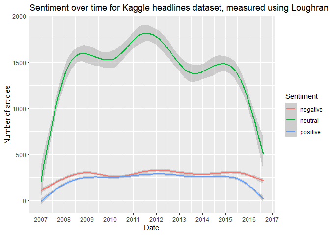<!-- -->
