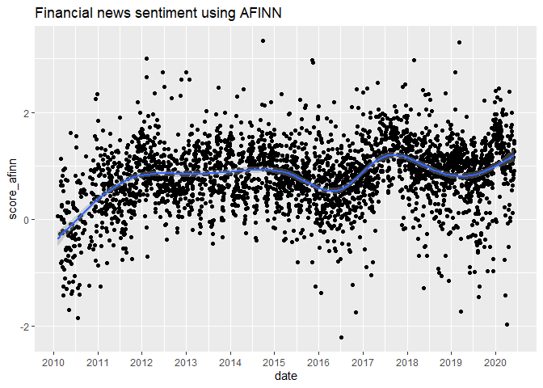

Sentiment Analysis of Financial News
================

Instructies:

1.  Download deze dataset van Kaggle:
    <https://www.kaggle.com/datasets/miguelaenlle/massive-stock-news-analysis-db-for-nlpbacktests?select=raw_partner_headlines.csv>

2.  Download de tabel raw_partner_headlines.csv (of download alle
    tabellen en bewaar alleen raw_partner_headlines.csv)

3.  Pak de tabel uit, zodat het geen .zip maar een .csv bestand is

4.  Zet de tabel in dezelfde map als dit bestand (main.rmd)

5.  Open main.rmd in RStudio en klik op Run \> Run All

## Packages

De volgende packages worden gebruikt in dit script:

- ggplot2: kan data visualiseren in grafieken

- dplyr: kan data bewerken op een toegankelijke manier dan dat standaard
  vanuit R kan

- tidytext: zitten functies in voor sentimentanalyse

- textdata: zitten woordenboeken in die nodig zijn voor sentimentanalyse

``` r
library(dplyr)
library(ggplot2)
library(tidytext)
```

    ## Warning: package 'tidytext' was built under R version 4.2.3

``` r
library(textdata)
```

    ## Warning: package 'textdata' was built under R version 4.2.3

## Data importeren

We lezen hier het bestand van Kaggle in zodat we het kunnen verwerken.
Hieronder zie je de datatypes van de kolommen. Alle kolommen zijn tekst,
inclusief het veld waar de datum in staat. Dat gaan we later aanpassen.

``` r
headlines <- read.csv('raw_partner_headlines.csv')
str(headlines)
```

    ## 'data.frame':    1845559 obs. of  6 variables:
    ##  $ X        : int  2 3 4 5 6 7 8 9 10 11 ...
    ##  $ headline : chr  "Agilent Technologies Announces Pricing of $5…… Million of Senior Notes" "Agilent (A) Gears Up for Q2 Earnings: What's in the Cards?" "J.P. Morgan Asset Management Announces Liquidation of Six Exchange-Traded Funds" "Pershing Square Capital Management, L.P. Buys Agilent Technologies Inc, The Howard Hughes Corp, ..." ...
    ##  $ url      : chr  "http://www.gurufocus.com/news/1153187/agilent-technologies-announces-pricing-of-500-million-of-senior-notes" "http://www.zacks.com/stock/news/931205/agilent-a-gears-up-for-q2-earnings-whats-in-the-cards?cid=CS-BENZ-FT-ana"| __truncated__ "http://www.gurufocus.com/news/1138923/jp-morgan-asset-management-announces-liquidation-of-six-exchangetraded-funds" "http://www.gurufocus.com/news/1138704/pershing-square-capital-management-lp-buys-agilent-technologies-inc-the-h"| __truncated__ ...
    ##  $ publisher: chr  "GuruFocus" "Zacks" "GuruFocus" "GuruFocus" ...
    ##  $ date     : chr  "2020-06-01 00:00:00" "2020-05-18 00:00:00" "2020-05-15 00:00:00" "2020-05-15 00:00:00" ...
    ##  $ stock    : chr  "A" "A" "A" "A" ...

Dit zijn de eerste paar regels van de headlines tabel.

``` r
head(headlines)
```

    ##   X
    ## 1 2
    ## 2 3
    ## 3 4
    ## 4 5
    ## 5 6
    ## 6 7
    ##                                                                                              headline
    ## 1                              Agilent Technologies Announces Pricing of $5…… Million of Senior Notes
    ## 2                                          Agilent (A) Gears Up for Q2 Earnings: What's in the Cards?
    ## 3                     J.P. Morgan Asset Management Announces Liquidation of Six Exchange-Traded Funds
    ## 4 Pershing Square Capital Management, L.P. Buys Agilent Technologies Inc, The Howard Hughes Corp, ...
    ## 5                                  Agilent Awards Trilogy Sciences with a Golden Ticket at LabCentral
    ## 6      Agilent Technologies Inc (A) CEO and President Michael R. Mcmullen Sold $–.4 million of Shares
    ##                                                                                                                                                                           url
    ## 1                                                                 http://www.gurufocus.com/news/1153187/agilent-technologies-announces-pricing-of-500-million-of-senior-notes
    ## 2                            http://www.zacks.com/stock/news/931205/agilent-a-gears-up-for-q2-earnings-whats-in-the-cards?cid=CS-BENZ-FT-analyst_blog|earnings_preview-931205
    ## 3                                                          http://www.gurufocus.com/news/1138923/jp-morgan-asset-management-announces-liquidation-of-six-exchangetraded-funds
    ## 4 http://www.gurufocus.com/news/1138704/pershing-square-capital-management-lp-buys-agilent-technologies-inc-the-howard-hughes-corp-lowes-inc-sells-chipotle-mexican-grill-inc
    ## 5                                                                    http://www.gurufocus.com/news/1134012/agilent-awards-trilogy-sciences-with-a-golden-ticket-at-labcentral
    ## 6                                             http://www.gurufocus.com/news/1132985/agilent-technologies-inc-a-ceo-and-president-michael-r-mcmullen-sold-14-million-of-shares
    ##   publisher                date stock
    ## 1 GuruFocus 2020-06-01 00:00:00     A
    ## 2     Zacks 2020-05-18 00:00:00     A
    ## 3 GuruFocus 2020-05-15 00:00:00     A
    ## 4 GuruFocus 2020-05-15 00:00:00     A
    ## 5 GuruFocus 2020-05-12 00:00:00     A
    ## 6 GuruFocus 2020-05-11 00:00:00     A

We gaan nu de datums goed zetten. Kolom date heeft de vorm YYYY-MM-DD.
De uren / minuten laten we voor wat het is, die hebben we niet nodig.
Van de identifier (‘X’) maken we een character ipv cijfer.

``` r
headlines$date <- as.Date(headlines$date, format = "%Y-%m-%d")
headlines$X <- as.character(headlines$X)
head(headlines)
```

    ##   X
    ## 1 2
    ## 2 3
    ## 3 4
    ## 4 5
    ## 5 6
    ## 6 7
    ##                                                                                              headline
    ## 1                              Agilent Technologies Announces Pricing of $5…… Million of Senior Notes
    ## 2                                          Agilent (A) Gears Up for Q2 Earnings: What's in the Cards?
    ## 3                     J.P. Morgan Asset Management Announces Liquidation of Six Exchange-Traded Funds
    ## 4 Pershing Square Capital Management, L.P. Buys Agilent Technologies Inc, The Howard Hughes Corp, ...
    ## 5                                  Agilent Awards Trilogy Sciences with a Golden Ticket at LabCentral
    ## 6      Agilent Technologies Inc (A) CEO and President Michael R. Mcmullen Sold $–.4 million of Shares
    ##                                                                                                                                                                           url
    ## 1                                                                 http://www.gurufocus.com/news/1153187/agilent-technologies-announces-pricing-of-500-million-of-senior-notes
    ## 2                            http://www.zacks.com/stock/news/931205/agilent-a-gears-up-for-q2-earnings-whats-in-the-cards?cid=CS-BENZ-FT-analyst_blog|earnings_preview-931205
    ## 3                                                          http://www.gurufocus.com/news/1138923/jp-morgan-asset-management-announces-liquidation-of-six-exchangetraded-funds
    ## 4 http://www.gurufocus.com/news/1138704/pershing-square-capital-management-lp-buys-agilent-technologies-inc-the-howard-hughes-corp-lowes-inc-sells-chipotle-mexican-grill-inc
    ## 5                                                                    http://www.gurufocus.com/news/1134012/agilent-awards-trilogy-sciences-with-a-golden-ticket-at-labcentral
    ## 6                                             http://www.gurufocus.com/news/1132985/agilent-technologies-inc-a-ceo-and-president-michael-r-mcmullen-sold-14-million-of-shares
    ##   publisher       date stock
    ## 1 GuruFocus 2020-06-01     A
    ## 2     Zacks 2020-05-18     A
    ## 3 GuruFocus 2020-05-15     A
    ## 4 GuruFocus 2020-05-15     A
    ## 5 GuruFocus 2020-05-12     A
    ## 6 GuruFocus 2020-05-11     A

## Sentiment analyseren

Er zijn verschillende methodes om sentiment uit een tekst te halen. Dit
is een voorbeeld van een goede implementatie:
<https://www.tidytextmining.com/sentiment.html>. Vaak worden
tekstverwerkingstappen aan het begin toegepast (bijv. woorden
terugbrengen tot de stam, cijfers en symbolen verwijderen, enz.). Soms
kan dat je model meer accuraat maken, voor nu slaan we dat even over.

De methodes die we gebruiken voor sentimentanalyse zijn gebaseerd op een
woordenboek dat specifieke waardes toekent aan elk woord. Hieronder zie
je een voorbeeld voor de methode AFINN. ‘abandon’ krijgt een waarde van
-2, ‘abhorrent’ een waarde van -3. Als alleen het woord ‘abhorrent’ in
een headline staat, zal die headline dus een score van -3 krijgen. Als
een woord niet gevonden kan worden in het woordenboek, wordt het woord
genegeerd en heeft het geen impact op de score.

``` r
get_sentiments("afinn")
```

    ## # A tibble: 2,477 × 2
    ##    word       value
    ##    <chr>      <dbl>
    ##  1 abandon       -2
    ##  2 abandoned     -2
    ##  3 abandons      -2
    ##  4 abducted      -2
    ##  5 abduction     -2
    ##  6 abductions    -2
    ##  7 abhor         -3
    ##  8 abhorred      -3
    ##  9 abhorrent     -3
    ## 10 abhors        -3
    ## # … with 2,467 more rows

We gaat de tekst ‘tokenizen’. De zin ‘ik ga naar huis’ wordt dan ‘ik’,
‘ga’, ‘naar’, ‘huis’. Eerst halen we zo alle losse woorden eruit, daarna
houden we elk woord tegen het woordenboek om te zien welk sentiment
erbij hoort. Het resultaat zie je hieronder. Veel woorden komen niet in
het woordenboek voor, en krijgen daarom ‘NA’ als waarde. Op zich is dat
logisch - zelfstandige naamwoorden zoals ‘million’ of ‘company’ horen
geen sentiment te hebben.

``` r
tokenized <- headlines %>% unnest_tokens(word, headline)
afinn <- get_sentiments("afinn")
tokenized <- tokenized %>% left_join(afinn, by = "word") 
head(tokenized)
```

    ##   X
    ## 1 2
    ## 2 2
    ## 3 2
    ## 4 2
    ## 5 2
    ## 6 2
    ##                                                                                                           url
    ## 1 http://www.gurufocus.com/news/1153187/agilent-technologies-announces-pricing-of-500-million-of-senior-notes
    ## 2 http://www.gurufocus.com/news/1153187/agilent-technologies-announces-pricing-of-500-million-of-senior-notes
    ## 3 http://www.gurufocus.com/news/1153187/agilent-technologies-announces-pricing-of-500-million-of-senior-notes
    ## 4 http://www.gurufocus.com/news/1153187/agilent-technologies-announces-pricing-of-500-million-of-senior-notes
    ## 5 http://www.gurufocus.com/news/1153187/agilent-technologies-announces-pricing-of-500-million-of-senior-notes
    ## 6 http://www.gurufocus.com/news/1153187/agilent-technologies-announces-pricing-of-500-million-of-senior-notes
    ##   publisher       date stock         word value
    ## 1 GuruFocus 2020-06-01     A      agilent    NA
    ## 2 GuruFocus 2020-06-01     A technologies    NA
    ## 3 GuruFocus 2020-06-01     A    announces    NA
    ## 4 GuruFocus 2020-06-01     A      pricing    NA
    ## 5 GuruFocus 2020-06-01     A           of    NA
    ## 6 GuruFocus 2020-06-01     A            5    NA

We kunnen de scores nu optellen per artikel. Elke keer als er ‘NA’ staat
negeren we dat, zodat ‘NA’ als 0 meetelt en geen invloed heeft op het
sentiment. We voegen de scores dan toe aan de originele artikelen.

``` r
scores <- tokenized %>% group_by(X) %>%
  summarize(sentiment_score = sum(value, na.rm = T))

headlines <- headlines %>% left_join(scores, by = "X")
```

Nu we de sentimentscores hebben kunnen we checken of we ze logisch
vinden. Dit zijn de headlines met de laagste sentimentscores. Wat opvalt
is dat het bovenste artikel drie keer voorkomt, omdat er drie
verschillende stocks in besproken worden. Dat is niet wat we willen, elk
artikel zou maximaal één keer mogen voorkomen. Dit zou je kunnen
onderzoeken om te zien hoeveel dubbele artikelen in de data zitten, ik
laat het voor nu wat het is.

``` r
headlines %>% arrange(sentiment_score) %>% head(n = 10)
```

    ##          X
    ## 1  1555768
    ## 2  1652377
    ## 3  1802578
    ## 4   857083
    ## 5    46408
    ## 6   225769
    ## 7   435093
    ## 8   484755
    ## 9   660578
    ## 10  672309
    ##                                                                                                                                             headline
    ## 1                                                                                                                    It's A Mad, Mad, Mad, Mad World
    ## 2                                                                                                                    It's A Mad, Mad, Mad, Mad World
    ## 3                                                                                                                    It's A Mad, Mad, Mad, Mad World
    ## 4                                                 Former Insys Reimbursement Services manager arrested on charges of conspiracy to commit wire fraud
    ## 5                                                                   Palladium Shortages Expose Broken Futures Markets; Craig Hemke Warns Of Fraud...
    ## 6                                                                            The Dirt Cheap Value Portfolio - Despair, Destruction And Doom Dominate
    ## 7  Coronavirus Stock Market Correction Takes Hold As Dow Jones Suffers Worst Week Loss In Years; Microsoft, Mastercard Warn, Disney CEO Bob Iger Out
    ## 8                                                                   Palladium Shortages Expose Broken Futures Markets; Craig Hemke Warns Of Fraud...
    ## 9                                                                 Misleading Marketing, Poor Risk Management, And Bad Trade Recommendations Dog FXCM
    ## 10                                                                           Crude, Credit Crash As Stocks Suffer Worst Black Friday Loss Since 2010
    ##                                                                                                                                                                                                        url
    ## 1                                                                                                                   https://seekingalpha.com/article/4132287-mad-mad-mad-mad-world?source=partner_benzinga
    ## 2                                                                                                                   https://seekingalpha.com/article/4132287-mad-mad-mad-mad-world?source=partner_benzinga
    ## 3                                                                                                                   https://seekingalpha.com/article/4132287-mad-mad-mad-mad-world?source=partner_benzinga
    ## 4                                                   http://seekingalpha.com/news/3214639-former-insys-reimbursement-services-manager-arrested-charges-conspiracy-commit-wire-fraud?source=partner_benzinga
    ## 5                                                               https://seekingalpha.com/article/4227166-palladium-shortages-expose-broken-futures-markets-craig-hemke-warns-fraud?source=partner_benzinga
    ## 6                                                                             http://seekingalpha.com/article/4005505-dirt-cheap-value-portfolio-despair-destruction-doom-dominate?source=partner_benzinga
    ## 7  http://www.investors.com/market-trend/stock-market-today/coronavirus-stock-market-correction-dow-jones-punges-microsoft-mastercard-warn-disney-ceo-bob-iger-out/?src=A00237A&ven=BenzingaCP&src=AURLAAM
    ## 8                                                               https://seekingalpha.com/article/4227166-palladium-shortages-expose-broken-futures-markets-craig-hemke-warns-fraud?source=partner_benzinga
    ## 9                                                         http://seekingalpha.com/article/2873776-misleading-marketing-poor-risk-management-and-bad-trade-recommendations-dog-fxcm?source=partner_benzinga
    ## 10                                                                                                                                                                  https://www.benzinga.com/node/12746713
    ##                    publisher       date stock sentiment_score
    ## 1              Seeking Alpha 2017-12-16  SVXY             -12
    ## 2              Seeking Alpha 2017-12-16  TVIX             -12
    ## 3              Seeking Alpha 2017-12-16   XIV             -12
    ## 4              Seeking Alpha 2016-10-18  INSY             -11
    ## 5              Seeking Alpha 2018-12-08   AGQ             -10
    ## 6              Seeking Alpha 2016-09-11  BRID             -10
    ## 7  Investor's Business Daily 2020-02-28   DIS             -10
    ## 8              Seeking Alpha 2018-12-08   DZZ             -10
    ## 9              Seeking Alpha 2015-02-02  FXCM             -10
    ## 10               TalkMarkets 2018-11-23   GBB             -10

Dit zijn de headlines met het meest positieve sentiment.

``` r
headlines %>% arrange(desc(sentiment_score)) %>% head(n = 10)
```

    ##          X
    ## 1   760905
    ## 2   697816
    ## 3   936248
    ## 4   999893
    ## 5  1065736
    ## 6   155537
    ## 7   222520
    ## 8   381899
    ## 9   572263
    ## 10  595914
    ##                                                                                                                headline
    ## 1                                       Hi-Crush Partners' Blair Acquisition: A 'Win, Win' Or A 'Win, Win Not So Much'?
    ## 2  High-Yield Preferred Stock, Strong Buy, Win-Win Situation, A Most Interesting Preferred From Landmark Infrastructure
    ## 3                            Key Private Bank Wins —…–9 Family Wealth Report Award For Best Fiduciary Or Trust Services
    ## 4  High-Yield Preferred Stock, Strong Buy, Win-Win Situation, A Most Interesting Preferred From Landmark Infrastructure
    ## 5                                           Middleby - Great Growth, Great Deals, Great Track Record, Not A Great Price
    ## 6                            Acuity Brands Products Win Best of Category, Design Excellence Award During LIGHTFAIR® ...
    ## 7                                         Brocade Wins Best of Show Grand Prize Award for SDI/NFV at Interop Tokyo —…–6
    ## 8                       Cubic and Rail Delivery Group Win "Excellence in Technology" Award from London Transport Awards
    ## 9                                         Canada's Freeland says 'win-win-win' on U.S. trade deal within reach: Reuters
    ## 10                                                               Ram —5…… Wins Popular Science Best of What's New Award
    ##                                                                                                                                                        url
    ## 1                                 http://seekingalpha.com/article/3998799-hi-crush-partners-blair-acquisition-win-win-win-win-much?source=partner_benzinga
    ## 2  https://seekingalpha.com/article/4235958-high-yield-preferred-stock-strong-buy-win-win-situation-interesting-preferred-landmark?source=partner_benzinga
    ## 3                         http://www.gurufocus.com/news/1112791/key-private-bank-wins-2019-family-wealth-report-award-for-best-fiduciary-or-trust-services
    ## 4  https://seekingalpha.com/article/4235958-high-yield-preferred-stock-strong-buy-win-win-situation-interesting-preferred-landmark?source=partner_benzinga
    ## 5                   http://seekingalpha.com/article/2987906-middleby-great-growth-great-deals-great-track-record-not-a-great-price?source=partner_benzinga
    ## 6             http://www.gurufocus.com/news/884231/acuity-brands-products-win-best-of-category-design-excellence-award-during-lightfair-international-2019
    ## 7                                        http://www.gurufocus.com/news/422049/brocade-wins-best-of-show-grand-prize-award-for-sdinfv-at-interop-tokyo-2016
    ## 8                      http://www.gurufocus.com/news/1092625/cubic-and-rail-delivery-group-win-excellence-in-technology-award-from-london-transport-awards
    ## 9                      https://seekingalpha.com/news/3387313-canadas-freeland-says-win-win-win-u-s-trade-deal-within-reach-reuters?source=partner_benzinga
    ## 10                                                                                                                  https://www.benzinga.com/node/14924744
    ##        publisher       date stock sentiment_score
    ## 1  Seeking Alpha 2016-08-11  HCLP              15
    ## 2  Seeking Alpha 2019-01-29  GLAD              14
    ## 3      GuruFocus 2020-04-22   KEY              14
    ## 4  Seeking Alpha 2019-01-29  LMRK              14
    ## 5  Seeking Alpha 2015-03-11  MIDD              14
    ## 6      GuruFocus 2019-05-23   AYI              13
    ## 7      GuruFocus 2016-06-16  BRCD              13
    ## 8      GuruFocus 2020-04-01   CUB              13
    ## 9  Seeking Alpha 2018-08-31   EWC              13
    ## 10     GuruFocus 2019-12-03  FCAU              13

We kunnen het testen van hierboven verder doortrekken door het sentiment
te berekenen per bedrijf. Om te voorkomen dat één artikel het hele
sentiment bepaalt, voegen we ook het aantal artikelen per bedrijf toe.

``` r
company <- headlines %>% group_by(stock) %>% summarize(n_articles = n(),
                                            avg_sentiment = mean(sentiment_score))
head(company)
```

    ## # A tibble: 6 × 3
    ##   stock n_articles avg_sentiment
    ##   <chr>      <int>         <dbl>
    ## 1 A            936        0.381 
    ## 2 AA           214        0.0748
    ## 3 AAC          217        0.244 
    ## 4 AADR          30        0.733 
    ## 5 AAL           34       -0.382 
    ## 6 AAMC          92        0.924

Vervolgens pakken we alleen de bedrijven waar minstens 30 artikelen over
zijn geschreven en die het laagste sentiment hebben. De bedrijven met de
slechtste sentimenten zijn ‘MCZ’, ‘GHI’ en ‘FHK’.

``` r
company %>% filter(n_articles >= 30) %>% arrange(avg_sentiment) %>% head()
```

    ## # A tibble: 6 × 3
    ##   stock n_articles avg_sentiment
    ##   <chr>      <int>         <dbl>
    ## 1 MCZ           32        -2.09 
    ## 2 GHI           50        -0.98 
    ## 3 FHK           70        -0.886
    ## 4 YOD           46        -0.804
    ## 5 RINF          50        -0.78 
    ## 6 EMSH          50        -0.74

Nu gaan we kijken naar de headlines die deze bedrijven hebben. Bij ‘MCZ’
valt het op dat ook neutrale headlines een negative score hebben. De
naam van het bedrijf is ‘Mad Catz’ en dat verklaart waarom - ‘Mad’ zal
in het woordenboek een negatieve score hebben, waardoor elke headline
waarin het bedrijf genoemd is (onterecht) negatief is. Eigenlijk zouden
bedrijfsnamen uit de headlines gefilterd moeten worden, aangezien die
geen onderdeel zijn van het sentiment. Voor nu is dat te moeilijk.

``` r
headlines %>% filter(stock == 'MCZ') %>% head()
```

    ##         X
    ## 1 1042124
    ## 2 1042125
    ## 3 1042126
    ## 4 1042127
    ## 5 1042128
    ## 6 1042129
    ##                                                                                            headline
    ## 1                                       A Look At The ESports Trend And The Main Companies Involved
    ## 2 Mad Catz® Announces Suspension of Trading and Commencement of NYSE MKT Delisting Procedures; ...
    ## 3     Mad Catz Interactive's (MCZ) CEO Karen McGinnis on Q3 2017 Results - Earnings Call Transcript
    ## 4                                                            Mad Catz Interactive misses on revenue
    ## 5     Mad Catz Interactive's (MCZ) CEO Karen McGinnis on Q2 2017 Results - Earnings Call Transcript
    ## 6                                            Mad Catz Interactive beats by $0.08, misses on revenue
    ##                                                                                                                                                                                      url
    ## 1                                                                            https://seekingalpha.com/article/4271691-look-esports-trend-main-companies-involved?source=partner_benzinga
    ## 2 http://www.gurufocus.com/news/494920/mad-catz-announces-suspension-of-trading-and-commencement-of-nyse-mkt-delisting-procedures-common-stock-expected-to-begin-trading-on-the-otc-pink
    ## 3                                  http://seekingalpha.com/article/4042307-mad-catz-interactives-mcz-ceo-karen-mcginnis-q3-2017-results-earnings-call-transcript?source=partner_benzinga
    ## 4                                                                                       http://seekingalpha.com/news/3240238-mad-catz-interactive-misses-revenue?source=partner_benzinga
    ## 5                                  http://seekingalpha.com/article/4019394-mad-catz-interactives-mcz-ceo-karen-mcginnis-q2-2017-results-earnings-call-transcript?source=partner_benzinga
    ## 6                                                                            http://seekingalpha.com/news/3220950-mad-catz-interactive-beats-0_08-misses-revenue?source=partner_benzinga
    ##       publisher       date stock sentiment_score
    ## 1 Seeking Alpha 2019-06-23   MCZ               0
    ## 2     GuruFocus 2017-03-23   MCZ              -3
    ## 3 Seeking Alpha 2017-02-02   MCZ              -3
    ## 4 Seeking Alpha 2017-02-02   MCZ              -3
    ## 5 Seeking Alpha 2016-11-03   MCZ              -3
    ## 6 Seeking Alpha 2016-11-03   MCZ              -3

Bij GHI komen de negatieve headlines door iets anders, GHI staat voor
Global Health Intelligence en is een research agency dat artikelen
schrijft over emerging markets. FHK staat voor First Trust Hong Kong en
is een investment fund dat wordt aangehaald in artikelen over een
mogelijke handelsoorlog tussen VS en China. De headlines zijn hier
correct geïnterpreteerd.

``` r
headlines %>% filter(stock == 'GHI') %>% head()
```

    ##        X
    ## 1 692034
    ## 2 692035
    ## 3 692036
    ## 4 692037
    ## 5 692038
    ## 6 692039
    ##                                                                   headline
    ## 1                   Wary Of Emerging Market Debt In 2019? You Shouldn't Be
    ## 2                  Emerging Markets Equity Investing: Never Waste A Crisis
    ## 3 Emerging-Market Debt: Going Into The New Year With More Realistic Prices
    ## 4    BofA clients are wary on emerging markets, looking to go long in 2019
    ## 5                                              Would You Lend To This Man?
    ## 6                        Emerging Markets: Vulnerable To External Factors?
    ##                                                                                                                     url
    ## 1                       https://seekingalpha.com/article/4231018-wary-emerging-market-debt-2019?source=partner_benzinga
    ## 2 https://seekingalpha.com/article/4230940-emerging-markets-equity-investing-never-waste-crisis?source=partner_benzinga
    ## 3 https://seekingalpha.com/article/4230506-emerging-market-debt-going-new-year-realistic-prices?source=partner_benzinga
    ## 4 https://seekingalpha.com/news/3416504-bofa-clients-wary-emerging-markets-looking-go-long-2019?source=partner_benzinga
    ## 5                                             https://seekingalpha.com/article/4227837-lend-man?source=partner_benzinga
    ## 6         https://seekingalpha.com/article/4226768-emerging-markets-vulnerable-external-factors?source=partner_benzinga
    ##       publisher       date stock sentiment_score
    ## 1 Seeking Alpha 2019-01-02   GHI              -2
    ## 2 Seeking Alpha 2019-01-01   GHI              -4
    ## 3 Seeking Alpha 2018-12-28   GHI              -2
    ## 4 Seeking Alpha 2018-12-12   GHI               0
    ## 5 Seeking Alpha 2018-12-12   GHI               0
    ## 6 Seeking Alpha 2018-12-06   GHI              -2

``` r
headlines %>% filter(stock == 'FHK') %>% head()
```

    ##        X                                         headline
    ## 1 615391 Is China's Power A Threat To The Global Economy?
    ## 2 615392    Hong Kong protests mark six-month anniversary
    ## 3 615393        Worst slump on record for HK retail sales
    ## 4 615394             Beijing's HK retaliation skips trade
    ## 5 615395               Beijing HK retaliation skips trade
    ## 6 615396       Risk aversion returns after Hong Kong move
    ##                                                                                                                                 url
    ## 1 https://seekingalpha.com/article/4311729-is-chinas-power-threat-to-global-economy?utm_source=partner_&utm_medium=referralbenzinga
    ## 2                       https://seekingalpha.com/news/3524633-hong-kong-protests-mark-six-month-anniversary?source=partner_benzinga
    ## 3                                  https://seekingalpha.com/news/3523231-worst-slump-record-hk-retail-sales?source=partner_benzinga
    ## 4                                 https://seekingalpha.com/news/3522820-beijings-hk-retaliation-skips-trade?source=partner_benzinga
    ## 5                                  https://seekingalpha.com/news/3522820-beijing-hk-retaliation-skips-trade?source=partner_benzinga
    ## 6                                https://seekingalpha.com/news/3522554-risk-aversion-returns-hong-kong-move?source=partner_benzinga
    ##       publisher       date stock sentiment_score
    ## 1 Seeking Alpha 2019-12-11   FHK              -2
    ## 2 Seeking Alpha 2019-12-08   FHK              -2
    ## 3 Seeking Alpha 2019-12-03   FHK              -3
    ## 4 Seeking Alpha 2019-12-02   FHK               0
    ## 5 Seeking Alpha 2019-12-02   FHK               0
    ## 6 Seeking Alpha 2019-11-28   FHK              -2

De volgende stap is het berekenen van sentiment over tijd. We pakken de
headlines, groeperen ze op datum en pakken het gemiddelde. In de
resultaten zit een artikel uit 1969 - dit zal een fout zijn, dus die
filteren we eruit. Net zoals bij de bedrijven stellen we een minimum aan
het aantal artikelen per dag, zodat de resultaten niet vertekend zijn
door maar een paar artikelen. (Ik gok dat de dagen waarop weinig
artikelen gepubliceerd worden, vooral zaterdagen en zondagen zijn. Die
zou je er ook systematisch uit kunnen filteren.)

Resultaten kunnen we plotten in grafiek. Er zit een trend lijn in met
confidence interval van 95% (dat is het lichtgrijze gebied rond de
lijn). De grafiek start negatief in 2010 (Europese schuldencrisis?),
heeft een dip in 2016 (?) en begin 2019 (corona?).

``` r
headlines %>% group_by(date) %>% 
  summarize(n_articles = n(), avg_sentiment = mean(sentiment_score)) %>%
  filter(date != as.Date("1969-12-31"), n_articles >= 15) %>%
  ggplot(aes(x = date, y = avg_sentiment)) + geom_point() + geom_smooth(level = 0.95) + 
  scale_x_date(breaks = "1 year", date_labels = "%Y")
```

    ## `geom_smooth()` using method = 'gam' and formula = 'y ~ s(x, bs = "cs")'

    ## Warning: Removed 2 rows containing non-finite values (`stat_smooth()`).

    ## Warning: Removed 2 rows containing missing values (`geom_point()`).

<!-- -->

Er zijn meerdere manieren om de methodologie sterker te maken:

1.  Het is mogelijk indicatoren op te zoeken van investor sentiment en
    die aan de grafiek toe te voegen. Dat kan ons meer vertrouwen geven
    of de cijfers overeen komen met wat we zouden verwachten.

2.  Het is mogelijk om andere meetmethodes toe te voegen voor sentiment
    en te kijken of die overeen komen met hierboven.

3.  Het is mogelijk om andere datasets te gebruiken om te zien of onze
    dataset representatief is voor financieel nieuws.

Van deze opties is 2 het makkelijkst. Hierboven heb ik sentimenten van
de methode AFINN gebruikt, maar er bestaan nog meer woordenlijsten met
sentimentwaardes. Ik gebruik ook de lijsten Bing, Loughran en Nrc. Ik
weet niet de inhoudelijke argumenten om een bepaalde methode te kiezen,
daarvoor kun je het beste zelf zoeken.

## Alternatieve sentimenten toevoegen

``` r
headlines <- headlines %>% rename(score_afinn = sentiment_score)

bing <- get_sentiments("bing")
nrc <- get_sentiments("nrc")
loughran <- get_sentiments("loughran")
```

``` r
tokenized <- headlines %>% unnest_tokens(word, headline)
tokenized <- tokenized %>% left_join(bing, by = "word") %>% rename(score_bing = sentiment)
tokenized <- tokenized %>% left_join(nrc, by = "word") %>% rename(score_nrc = sentiment)
tokenized <- tokenized %>% left_join(loughran, by = "word") %>% rename(score_loughran = sentiment)
head(tokenized)
```

    ##   X
    ## 1 2
    ## 2 2
    ## 3 2
    ## 4 2
    ## 5 2
    ## 6 2
    ##                                                                                                           url
    ## 1 http://www.gurufocus.com/news/1153187/agilent-technologies-announces-pricing-of-500-million-of-senior-notes
    ## 2 http://www.gurufocus.com/news/1153187/agilent-technologies-announces-pricing-of-500-million-of-senior-notes
    ## 3 http://www.gurufocus.com/news/1153187/agilent-technologies-announces-pricing-of-500-million-of-senior-notes
    ## 4 http://www.gurufocus.com/news/1153187/agilent-technologies-announces-pricing-of-500-million-of-senior-notes
    ## 5 http://www.gurufocus.com/news/1153187/agilent-technologies-announces-pricing-of-500-million-of-senior-notes
    ## 6 http://www.gurufocus.com/news/1153187/agilent-technologies-announces-pricing-of-500-million-of-senior-notes
    ##   publisher       date stock score_afinn         word score_bing score_nrc
    ## 1 GuruFocus 2020-06-01     A           0      agilent       <NA>      <NA>
    ## 2 GuruFocus 2020-06-01     A           0 technologies       <NA>      <NA>
    ## 3 GuruFocus 2020-06-01     A           0    announces       <NA>      <NA>
    ## 4 GuruFocus 2020-06-01     A           0      pricing       <NA>      <NA>
    ## 5 GuruFocus 2020-06-01     A           0           of       <NA>      <NA>
    ## 6 GuruFocus 2020-06-01     A           0            5       <NA>      <NA>
    ##   score_loughran
    ## 1           <NA>
    ## 2           <NA>
    ## 3           <NA>
    ## 4           <NA>
    ## 5           <NA>
    ## 6           <NA>

Deze nieuwe scores werken anders. In plaats van cijfers kennen ze
categorieën toe. Daar moeten we eerst cijfers van maken. Voor bing gaat
dat het makkelijkst, daar is de classificering positive of negative.

``` r
tokenized %>% group_by(score_bing) %>% count()
```

    ## # A tibble: 3 × 2
    ## # Groups:   score_bing [3]
    ##   score_bing        n
    ##   <chr>         <int>
    ## 1 negative     857470
    ## 2 positive     960243
    ## 3 <NA>       17383728

Positive veranderen we in 1, negative in -1.

``` r
tokenized <- tokenized %>% mutate(score_bing = case_when(score_bing == "positive" ~ 1,
                                                         score_bing == "negative" ~ -1))
```

Bij nrc is het lastiger, daar hebben we meer categorieën. Voor nu kies
ik voor de makkelijkste oplossing: positive krijgt een 1, negative een
-1, rest wordt genegeerd.

``` r
tokenized %>% group_by(score_nrc) %>% count()
```

    ## # A tibble: 11 × 2
    ## # Groups:   score_nrc [11]
    ##    score_nrc           n
    ##    <chr>           <int>
    ##  1 anger          209758
    ##  2 anticipation   709435
    ##  3 disgust         91925
    ##  4 fear           284668
    ##  5 joy            297711
    ##  6 negative       615655
    ##  7 positive      1297361
    ##  8 sadness        212294
    ##  9 surprise       179560
    ## 10 trust          890721
    ## 11 <NA>         14412353

``` r
tokenized <- tokenized %>% mutate(score_nrc = case_when(score_nrc == "positive" ~ 1,
                                                        score_nrc == "negative" ~ -1))
```

Als laatste is nog loughran over. Ook hier zitten meer categorieën in
die we voor nu negeren, we pakken alleen positive en negative.

``` r
tokenized %>% group_by(score_loughran) %>% count()
```

    ## # A tibble: 7 × 2
    ## # Groups:   score_loughran [7]
    ##   score_loughran        n
    ##   <chr>             <int>
    ## 1 constraining       6701
    ## 2 litigious         53347
    ## 3 negative         490226
    ## 4 positive         413924
    ## 5 superfluous         289
    ## 6 uncertainty      142529
    ## 7 <NA>           18094425

``` r
tokenized <- tokenized %>% mutate(score_loughran = case_when(score_loughran == "positive" ~ 1,
                                                             score_loughran == "negative" ~ -1))
```

Nu we alle scores hebben omgezet naar cijfers, kunnen we ze bij elkaar
optellen om te zien wat de score per artikel is. We kunnen ze dan weer
samenvoegen met headlines.

``` r
scores <- tokenized %>% group_by(X) %>%
  summarize(score_bing = sum(score_bing, na.rm = T),
            score_nrc = sum(score_nrc, na.rm = T),
            score_loughran = sum(score_loughran, na.rm = T))

head(scores)
```

    ## # A tibble: 6 × 4
    ##   X       score_bing score_nrc score_loughran
    ##   <chr>        <dbl>     <dbl>          <dbl>
    ## 1 10               0         1              0
    ## 2 100              0         0              0
    ## 3 1000             2         0              1
    ## 4 10000            0         0              0
    ## 5 100000           2         3              2
    ## 6 1000000          5         1              0

``` r
headlines <- headlines %>% left_join(scores, by = "X")
```

Het is mogelijk om ook dieper in de scores van de andere methodes te
duiken - wat zijn de meest positieve en negatieve dingen, kunnen de
andere groepen die we hierboven uit de data hebben gelaten ook mee, enz.
Ik laat die discussie voor wat het is en ga door met visualiseren.

``` r
graph_data <- headlines %>% group_by(date) %>% summarize(n_articles = n(),
                                           score_afinn = mean(score_afinn),
                                           score_bing = mean(score_bing),
                                           score_nrc = mean(score_nrc),
                                           score_loughran = mean(score_loughran))
graph_data <- graph_data %>% filter(date != as.Date("1969-12-31"), n_articles >= 15)
head(graph_data)
```

    ## # A tibble: 6 × 6
    ##   date       n_articles score_afinn score_bing score_nrc score_loughran
    ##   <date>          <int>       <dbl>      <dbl>     <dbl>          <dbl>
    ## 1 2010-02-03         25      0.44       0.24     -0.04           0     
    ## 2 2010-02-04         43      0.0233    -0.256     0.0233        -0.186 
    ## 3 2010-02-05         18     -0.167     -0.222    -0.333         -0.167 
    ## 4 2010-02-08         25      0.16       0.08      0.08           0.16  
    ## 5 2010-02-09         34      0.235     -0.441     0             -0.324 
    ## 6 2010-02-10         28     -0.143     -0.0357    0.25          -0.0357

``` r
graph_data %>% ggplot(aes(x = date, y = score_afinn)) + geom_point() + geom_smooth(level = 0.95) + 
  scale_x_date(breaks = "1 year", date_labels = "%Y") + ggtitle('Financial news sentiment using AFINN')
```

    ## `geom_smooth()` using method = 'gam' and formula = 'y ~ s(x, bs = "cs")'

    ## Warning: Removed 2 rows containing non-finite values (`stat_smooth()`).

    ## Warning: Removed 2 rows containing missing values (`geom_point()`).

<!-- -->

``` r
graph_data %>% ggplot(aes(x = date, y = score_nrc)) + geom_point() + geom_smooth(level = 0.95) + 
  scale_x_date(breaks = "1 year", date_labels = "%Y") + ggtitle('Financial news sentiment using NRC')
```

    ## `geom_smooth()` using method = 'gam' and formula = 'y ~ s(x, bs = "cs")'

    ## Warning: Removed 2 rows containing non-finite values (`stat_smooth()`).
    ## Removed 2 rows containing missing values (`geom_point()`).

<!-- -->

``` r
graph_data %>% ggplot(aes(x = date, y = score_bing)) + geom_point() + geom_smooth(level = 0.95) + 
  scale_x_date(breaks = "1 year", date_labels = "%Y") + ggtitle('Financial news sentiment using Bing')
```

    ## `geom_smooth()` using method = 'gam' and formula = 'y ~ s(x, bs = "cs")'

    ## Warning: Removed 2 rows containing non-finite values (`stat_smooth()`).
    ## Removed 2 rows containing missing values (`geom_point()`).

<!-- -->

``` r
graph_data %>% ggplot(aes(x = date, y = score_loughran)) + geom_point() + geom_smooth(level = 0.95) + 
  scale_x_date(breaks = "1 year", date_labels = "%Y") + ggtitle('Financial news sentiment using Loughran')
```

    ## `geom_smooth()` using method = 'gam' and formula = 'y ~ s(x, bs = "cs")'

    ## Warning: Removed 2 rows containing non-finite values (`stat_smooth()`).
    ## Removed 2 rows containing missing values (`geom_point()`).

<!-- -->

## Sentiment zonder nulwaardes

Bij Bing en Loughran valt het op dat de serie erg dicht bij nul zit. Dit
komt mogelijk omdat veel headlines geen woorden hebben die in het
woordenboek staan, waardoor ze nul als score krijgen en zwaar naar nul
als gemiddelde trekken.

Het probleem hier is hoe we moeten omgaan met missing values. Tot nu toe
zijn we ervan uitgegaan dat een headline zonder woorden in de dictionary
neutraal is, en daarom het label 0 krijgt. Een mogelijk alternatief is
om de artikelen met score 0 weg te laten, omdat je niet met zekerheid
kan zeggen dat je ze neutraal kan classificeren. Hieronder is dat
geïmplementeerd. We pakken hier dus alleen de headlines met positief of
negatief sentiment, en laten de rest weg.

``` r
graph_data <- headlines %>% filter(score_afinn != 0) %>% 
  group_by(date) %>% summarize(n_articles = n(), score_afinn = mean(score_afinn))
graph_data <- graph_data %>% filter(date != as.Date("1969-12-31"), n_articles >= 15)

graph_data %>% ggplot(aes(x = date, y = score_afinn)) + geom_point() + geom_smooth(level = 0.95) + 
  scale_x_date(breaks = "1 year", date_labels = "%Y") + ggtitle('Financial news sentiment using AFINN')
```

    ## `geom_smooth()` using method = 'gam' and formula = 'y ~ s(x, bs = "cs")'

<!-- -->

``` r
graph_data <- headlines %>% filter(score_nrc != 0) %>% 
  group_by(date) %>% summarize(n_articles = n(), score_nrc = mean(score_nrc))
graph_data <- graph_data %>% filter(date != as.Date("1969-12-31"), n_articles >= 15)

graph_data %>% ggplot(aes(x = date, y = score_nrc)) + geom_point() + geom_smooth(level = 0.95) + 
  scale_x_date(breaks = "1 year", date_labels = "%Y") + ggtitle('Financial news sentiment using NRC')
```

    ## `geom_smooth()` using method = 'gam' and formula = 'y ~ s(x, bs = "cs")'

<!-- -->

``` r
graph_data <- headlines %>% filter(score_bing != 0) %>% 
  group_by(date) %>% summarize(n_articles = n(), score_bing = mean(score_bing))
graph_data <- graph_data %>% filter(date != as.Date("1969-12-31"), n_articles >= 15)

graph_data %>% ggplot(aes(x = date, y = score_bing)) + geom_point() + geom_smooth(level = 0.95) + 
  scale_x_date(breaks = "1 year", date_labels = "%Y") + ggtitle('Financial news sentiment using Bing')
```

    ## `geom_smooth()` using method = 'gam' and formula = 'y ~ s(x, bs = "cs")'

<!-- -->

``` r
graph_data <- headlines %>% filter(score_loughran != 0) %>% 
  group_by(date) %>% summarize(n_articles = n(), score_loughran = mean(score_loughran))
graph_data <- graph_data %>% filter(date != as.Date("1969-12-31"), n_articles >= 15)

graph_data %>% ggplot(aes(x = date, y = score_loughran)) + geom_point() + geom_smooth(level = 0.95) + 
  scale_x_date(breaks = "1 year", date_labels = "%Y") + ggtitle('Financial news sentiment using Loughran')
```

    ## `geom_smooth()` using method = 'gam' and formula = 'y ~ s(x, bs = "cs")'

<!-- -->

Bovenstaande grafieken zien er beter uit. Je ziet wel dat de metrics erg
verschillen. Bij AFINN is de standard error bijv. stuk groter dan bij
NRC. Dat heeft met de manier van meten te maken, bij AFINN kan een enkel
woord in een artikel al een score van 4 veroorzaken, terwijl dat bij NRC
maximaal 1 is. Je kan hier verder op experimenteren door de variabelen
vergelijkbaar te schalen. Maar op zich kan je dit al prima gebruiken als
dependent variable voor je regressie. Persoonlijk zou ik alle vier de
modellen testen, achterliggende redenen zoeken (wat maakt deze methodes
anders, hoe steken ze in elkaar) en kijken welk model de beste fit
oplevert met de data.

Als de variance te groot is om fatsoenlijk te kunnen gebruiken in een
regressie, zou je ook gemiddeldes kunnen pakken over langere periodes.
Dan gebruik je bijvoorbeeld het wekelijkse gemiddelde sentiment als
dependent variable. Eventueel kan je ook de blauwe trendlijn als
dependent variabele pakken, maar dat is erg kort door de bocht en
statistisch moeilijk te onderbouwen.

## Sentiment gemeten op emoties

Als laatste wil ik nog op een stuk verder doorbouwen: de extra
categorieën voor nrc en loughran. Kunnen we daar meer uithalen dan
alleen één variabele die laat zien hoe positief of negatief het nieuws
is?

Om dat te testen voegen we eerst de oorspronkelijke categorieën opnieuw
toe, we noemen ze category_nrc en category_loughran.

``` r
tokenized <- tokenized %>% left_join(nrc, by = "word") %>% rename(category_nrc = sentiment)
tokenized <- tokenized %>% left_join(loughran, by = "word") %>% rename(category_loughran = sentiment)
```

We berekenen dan het aantal woorden per emotie, artikel en datum.
Woorden die niet in een emotie geclassificeerd kunnen worden, worden
weer eruit gefilterd.

``` r
graph_data_nrc <- tokenized %>% 
  filter(!is.na(category_nrc)) %>% group_by(date, X, category_nrc) %>% count()
```

``` r
graph_data_nrc <- graph_data_nrc %>% filter(date != as.Date("1969-12-31"),
                                            !is.na(category_nrc))
```

Het aantal emoties per dag kan dan in een grafiek geplot worden. Wat
opvalt is dat ze allemaal een vergelijkbaar patroon volgen. Dat patroon
zal in lijn zijn met het aantal artikelen van de dataset. Om de
verschillen duidelijker te maken, is het ook mogelijk om de emoties te
plotten als % van alle emoties op één dag. Maar die grafieken blijven
redelijk stabiel.

Conclusie: het plotten van de emoties uit NRC lijkt weinig toegevoegde
waarde te hebben. Mogelijk is de classificatie te grof, of de data niet
representatief genoeg.

``` r
q <- graph_data_nrc %>% group_by(date, category_nrc) %>% summarize(n = sum(n))
```

    ## `summarise()` has grouped output by 'date'. You can override using the
    ## `.groups` argument.

``` r
q <- q %>% 
  left_join(q %>% group_by(date) %>% summarize(total = sum(n)), by = "date")
q %>% ggplot(aes(x=date, y=n)) + geom_smooth() + facet_wrap(~category_nrc)
```

    ## `geom_smooth()` using method = 'gam' and formula = 'y ~ s(x, bs = "cs")'

<!-- -->

``` r
q %>% ggplot(aes(x=date, y=n / total)) + geom_smooth(se = F) + facet_wrap(~category_nrc)
```

    ## `geom_smooth()` using method = 'gam' and formula = 'y ~ s(x, bs = "cs")'

<!-- -->

Als laatste hebben we dan nog Loughran. Dit is een woordenboek dat
specifiek is toegesplitst op financiële teksten, omdat het o.a.
gebaseerd is op teksten uit earnings calls. Ook hierin zit een
vergelijkbaar patroon.

``` r
graph_data_loughran <- tokenized %>% 
  filter(!is.na(category_loughran)) %>% group_by(date, X, category_loughran) %>% count()
```

``` r
r <- graph_data_loughran %>% group_by(date, category_loughran) %>% summarize(n = sum(n))
```

    ## `summarise()` has grouped output by 'date'. You can override using the
    ## `.groups` argument.

``` r
r %>% ggplot(aes(x=date, y=n)) + geom_smooth(se = F) + facet_wrap(~category_loughran)
```

    ## `geom_smooth()` using method = 'gam' and formula = 'y ~ s(x, bs = "cs")'

<!-- -->
